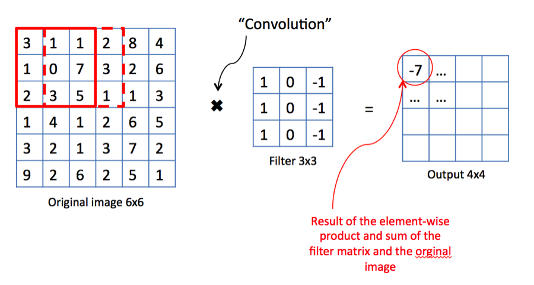
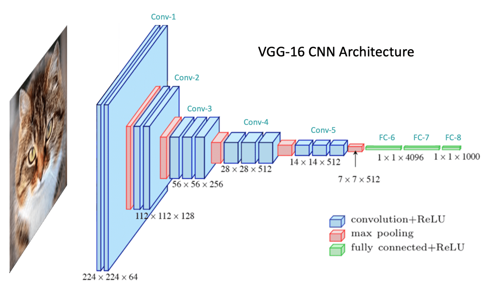
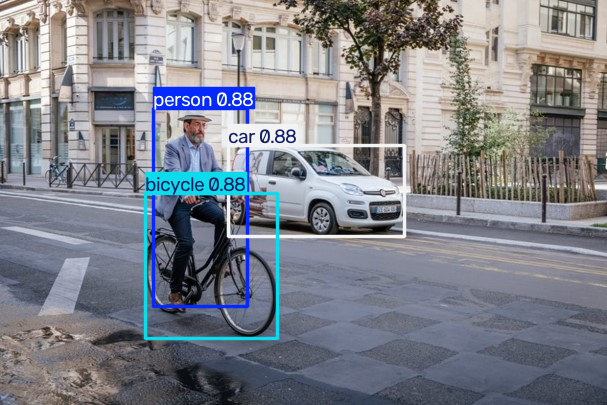

# 4강. Computer Vision과 Object Detection (YOLO 실습)

> 인공지능 4번째 강의 (실무 프로젝트) 정리 노트 — 2026. 09. 21
> 원본: `20260921DPLR.pptx` (강의 슬라이드), `0922실습.ipynb` (실습 노트북)
> 이미지 파일은 같은 폴더의 `AI-04-images/` 에 있다.

---

## 📌 목차

1. [Computer Vision이란?](#1-computer-vision이란)
2. [CNN과 합성곱 (Convolution)](#2-cnn과-합성곱-convolution)
3. [풀링 (Pooling)](#3-풀링-pooling)
4. [YOLO (You Only Look Once)](#4-yolo-you-only-look-once)
5. [후처리와 평가 지표: IoU, Precision, Recall, mAP](#5-후처리와-평가-지표-iou-precision-recall-map)
6. [실습: Ultralytics YOLO11로 객체 검출](#6-실습-ultralytics-yolo11로-객체-검출)
7. [요약](#7-요약)
8. [셀프 체크 퀴즈](#8-셀프-체크-퀴즈)

> 📝 표기: **[보충]** 이 붙은 내용은 슬라이드에 없지만 이해를 돕기 위해 추가한 설명이다.

### 이 강의의 흐름

```
Computer Vision ──▶ CNN (합성곱 + 풀링) ──▶ 객체 검출 모델 YOLO ──▶ 평가 지표 ──▶ 실습
  "무엇을 하나"       "어떻게 특징을 뽑나"     "어디에 무엇이 있나"   "얼마나 잘했나"   "직접 돌려보기"
```

---

## 1. Computer Vision이란?

> **컴퓨터가 입력받은 이미지(영상 포함)의 정보를 이해하고 처리할 수 있도록 만드는 기술**

### 1.1 컴퓨터에게 이미지는 "숫자 배열"이다

사람은 사진을 보면 바로 "자전거 탄 사람"이라고 알지만, 컴퓨터에게 이미지는 **숫자들의 배열**일 뿐이다.

```
흑백 이미지 (높이 × 너비)            컬러 이미지 (높이 × 너비 × 3채널)
┌─────┬─────┬─────┐                 R 채널   G 채널   B 채널
│  0  │ 128 │ 255 │                 ┌───┐   ┌───┐   ┌───┐
├─────┼─────┼─────┤                 │...│   │...│   │...│
│ 34  │ 200 │  90 │                 └───┘   └───┘   └───┘
└─────┴─────┴─────┘
각 값 = 픽셀 밝기 (0=검정, 255=흰색)
```

- 실습 노트북의 출력에서도 `orig_img: array([[[244, 230, 234], ...` 처럼 이미지가 **숫자 배열**(각 픽셀의 R, G, B 값)로 저장된 것을 볼 수 있다.
- Computer Vision의 핵심은 **이 숫자 배열에서 특징(feature)을 찾아내 학습**하는 것이다.

### 1.2 [보충] Computer Vision의 주요 작업

| 작업 | 질문 | 출력 | 예 |
|---|---|---|---|
| **분류 (Classification)** | 이 이미지는 **무엇**인가? | 클래스 1개 | "고양이" |
| **객체 검출 (Object Detection)** | **어디에 무엇**이 있는가? | 여러 개의 박스 + 클래스 | "사람(153,108)~(247,307)" ← 이번 강의 |
| **분할 (Segmentation)** | 각 **픽셀**이 무엇인가? | 픽셀 단위 마스크 | 도로 영역 칠하기 |
| **자세 추정 (Pose)** | 관절이 어디 있는가? | 키포인트 좌표 | 사람 골격 |

> 💡 실습 결과 객체의 `boxes`, `masks`, `keypoints`, `obb` 속성이 바로 이 작업들에 대응한다. 검출 모델(`yolo11n.pt`)을 썼으므로 `boxes`만 채워지고 나머지는 `None`이다.

---

## 2. CNN과 합성곱 (Convolution)

**대표적인 모델: CNN (Convolutional Neural Network, 합성곱 신경망)**

### 2.1 합성곱: 작은 필터를 이미지 위에서 움직이며 특징 추출



**동작 방식**
1. 작은 **필터(filter, kernel)** — 예: 3×3 — 를 이미지의 왼쪽 위에 올린다.
2. 겹치는 칸끼리 **곱한 뒤 모두 더한다** (element-wise product and sum).
3. 그 값을 출력(**특징 맵, feature map**)의 한 칸에 적는다.
4. 필터를 한 칸 옮기고 반복한다.

**슬라이드 예제 직접 계산해 보기**

원본 이미지 (6×6)와 필터 (3×3):

```
원본 이미지 6×6                    필터 3×3 (세로 경계 검출)
┌───┬───┬───┬───┬───┬───┐         ┌───┬───┬───┐
│ 3 │ 1 │ 1 │ 2 │ 8 │ 4 │         │ 1 │ 0 │-1 │
│ 1 │ 0 │ 7 │ 3 │ 2 │ 6 │         │ 1 │ 0 │-1 │
│ 2 │ 3 │ 5 │ 1 │ 1 │ 3 │         │ 1 │ 0 │-1 │
│ 1 │ 4 │ 1 │ 2 │ 6 │ 5 │         └───┴───┴───┘
│ 3 │ 2 │ 1 │ 3 │ 7 │ 2 │
│ 9 │ 2 │ 6 │ 2 │ 5 │ 1 │
└───┴───┴───┴───┴───┴───┘
```

**출력의 첫 칸 (−7) 계산**: 왼쪽 위 3×3 영역에 필터를 겹친다.

$$
\begin{aligned}
&(3\cdot1 + 1\cdot0 + 1\cdot(-1)) \\
+\;&(1\cdot1 + 0\cdot0 + 7\cdot(-1)) \\
+\;&(2\cdot1 + 3\cdot0 + 5\cdot(-1)) \\
=\;&(3 + 1 + 2) - (1 + 7 + 5) = 6 - 13 = \mathbf{-7}
\end{aligned}
$$

> 💡 이 필터는 "**왼쪽 열 합 − 오른쪽 열 합**"을 계산한다. 즉 **왼쪽과 오른쪽의 밝기 차이**, 다시 말해 **세로 방향 경계선(edge)** 에 크게 반응하는 필터다.

**전체 출력 (4×4)** — 직접 계산해 보고 맞춰 보자 **[보충]**

```
┌────┬────┬─────┬────┐
│ -7 │ -2 │   2 │ -7 │
│ -9 │  1 │   4 │ -8 │
│ -1 │  3 │  -7 │ -4 │
│  5 │  1 │ -10 │ -1 │
└────┴────┴─────┴────┘
```

**[보충] 출력 크기 공식**

$$
\text{출력 크기} = \frac{N - F + 2P}{S} + 1
$$

- $N$: 입력 크기, $F$: 필터 크기, $P$: 패딩(padding, 가장자리에 0을 덧댐), $S$: 스트라이드(stride, 필터 이동 칸 수)
- 슬라이드 예: $\frac{6 - 3 + 0}{1} + 1 = 4$ → 4×4 ✅
- 스트라이드를 2로 하면 $\frac{6-3}{2}+1 = 2.5$ → 나누어 떨어지지 않으므로 보통 내림하여 2×2

### 2.2 층이 깊어질수록 더 추상적인 특징

| 층 | 학습하는 특징 | 예 |
|---|---|---|
| **얕은 layer** | **edge / texture** (경계선, 질감) | 선, 모서리, 색 변화, 무늬 |
| 중간 layer **[보충]** | 부분 (part) | 바퀴, 눈, 창문 |
| **깊은 layer** | **object** (객체 전체) | 자전거, 사람, 자동차 |

- **pooling / stride** 등을 통해 **공간 정보를 압축**한다 (이미지 크기는 줄이고 특징은 남긴다).
- 결과 이미지의 **중요한 특징을 학습**하여 **분류, 검출**에 활용한다.

> 💡 **[보충] 필터는 누가 정하나?** 위 예제의 필터는 사람이 만든 것이지만, CNN에서는 필터의 숫자들이 **학습으로 자동 결정**되는 **가중치(파라미터)** 다. 데이터를 많이 보면서 "자전거를 알아보는 데 유용한 필터"를 스스로 찾아낸다.

### 2.3 예시: VGG-16 구조



| 색 | 의미 |
|---|---|
| 🟦 파랑 | convolution + ReLU (합성곱 + 활성화 함수) |
| 🟥 빨강 | max pooling |
| 🟩 초록 | fully connected + ReLU (완전 연결층) |

**크기 변화 따라가기**

```
입력 224×224×3
 → Conv-1  224×224×64    ─ max pool ─▶ 112×112
 → Conv-2  112×112×128   ─ max pool ─▶  56×56
 → Conv-3   56×56×256    ─ max pool ─▶  28×28
 → Conv-4   28×28×512    ─ max pool ─▶  14×14
 → Conv-5   14×14×512    ─ max pool ─▶   7×7×512
 → FC-6  1×1×4096 → FC-7  1×1×4096 → FC-8  1×1×1000  (1000개 클래스 점수)
```

**관찰 포인트**
- 풀링을 할 때마다 가로·세로가 **절반**으로 줄어든다 (224 → 112 → 56 → 28 → 14 → 7).
- 반대로 채널 수(특징의 종류)는 **늘어난다** (64 → 128 → 256 → 512).
- → "**위치 정보는 압축하고, 무엇이 있는지에 대한 정보는 풍부하게**" 만드는 과정
- 마지막 FC-8의 1000은 ImageNet 데이터셋의 **클래스 수**다. **[보충]**

---

## 3. 풀링 (Pooling)

**목적**: ① **연산량 감소** ② **파라미터 감소** ③ **과적합(overfitting) 방지**

> 💡 **[보충] 과적합이란?** 학습 데이터에만 너무 딱 맞춰져서 새로운 데이터에서는 성능이 떨어지는 현상. 풀링은 작은 위치 변화를 무시하게 만들어 모델이 세부 사항에 덜 집착하도록 돕는다.

### 3.1 풀링의 세 종류

| 종류 | 방법 | 특징 / 용도 |
|---|---|---|
| **Max Pooling** | 커널 영역 안에서 **가장 큰 값**만 추출 | **가장 보편적**. 경계선·질감처럼 **뚜렷하고 강한 특징을 강조** |
| **Average Pooling** | 영역 안 **모든 값의 평균** | 전체 정보를 **부드럽게(smoothing)**, **통계적 특성** 추출 |
| **Global Pooling** | 각 채널의 특징 맵 **전체를 하나의 값**으로 축소 | **파라미터 수를 극적으로 감소**. **ResNet**에서 주로 활용 |

### 3.2 [보충] 직접 계산해 보기

2.1절의 합성곱 출력(4×4)에 **2×2 풀링 (stride 2)** 을 적용해 보자.

```
합성곱 출력 4×4                영역을 2×2로 나누기
┌────┬────┬─────┬────┐        ┌─────────┬──────────┐
│ -7 │ -2 │   2 │ -7 │        │ -7  -2  │   2  -7  │
│ -9 │  1 │   4 │ -8 │        │ -9   1  │   4  -8  │
│ -1 │  3 │  -7 │ -4 │        ├─────────┼──────────┤
│  5 │  1 │ -10 │ -1 │        │ -1   3  │  -7  -4  │
└────┴────┴─────┴────┘        │  5   1  │ -10  -1  │
                              └─────────┴──────────┘
```

| 풀링 | 결과 (2×2) | 계산 |
|---|---|---|
| **Max** | `[[1, 4], [5, -1]]` | 왼쪽 위: max(−7, −2, −9, 1) = 1 |
| **Average** | `[[-4.25, -2.25], [2.0, -5.5]]` | 왼쪽 위: (−7 −2 −9 +1) / 4 = −4.25 |
| **Global Max** | `5` | 16개 전체 중 최댓값 |
| **Global Average** | `-2.5` | 16개 전체의 평균 |

- 4×4 → 2×2 : 데이터 양이 **1/4** 로 줄었다.
- 풀링에는 **학습할 파라미터가 없다** (최댓값/평균을 구하는 규칙만 있음).

### 3.3 [보충] Global Pooling이 파라미터를 "극적으로" 줄이는 이유

VGG-16에서 마지막 특징 맵 7×7×512를 FC-6(4096개)에 연결하는 경우와 비교해 보자.

| 방식 | FC층 입력 크기 | FC-6 가중치 수 |
|---|---|---|
| Flatten (VGG 방식) | 7 × 7 × 512 = 25,088 | 25,088 × 4,096 ≈ **1억 개** |
| Global Average Pooling | 512 (채널마다 값 1개) | 512 × 4,096 ≈ **210만 개** |

→ 약 **49배** 감소. 그래서 ResNet 같은 최근 모델은 Global Average Pooling을 쓴다.

---

## 4. YOLO (You Only Look Once)

### 4.1 핵심 아이디어

> 이미지를 **한 번의 네트워크 처리**로 보고, 객체의 **위치**와 **class**를 **동시에** 예측한다.

- 기존의 **여러 단계(multi-stage)** detection 방식과 비교해 **실시간 처리**에 유리하다.

**[보충] 기존 방식과의 비교**

| 구분 | 2단계 검출기 (예: R-CNN 계열) | 1단계 검출기 (YOLO) |
|---|---|---|
| 방식 | ① 객체가 있을 만한 **후보 영역**을 먼저 찾고 → ② 각 영역을 **따로 분류** | 이미지 전체를 **한 번에** 보고 박스와 클래스를 동시에 예측 |
| 속도 | 느림 | **빠름 (실시간)** |
| 비유 | 방을 구역별로 나눠 하나씩 확대경으로 살펴봄 | 방을 **한눈에** 훑어봄 |

> 💡 이름 그대로 "**You Only Look Once** — 한 번만 본다"

### 4.2 YOLO 처리 파이프라인

```
┌───────────────┐   ┌────────────┐   ┌──────────────────────────┐   ┌────────────────┐   ┌─────────────────┐
│ Preprocessing │──▶│ YOLO model │──▶│ Bounding boxes + Classes │──▶│ Post-processing│──▶│ Final Detection │
│    (전처리)    │   │            │   │      + Confidence         │   │    (후처리)     │   │   (최종 결과)    │
└───────────────┘   └────────────┘   └──────────────────────────┘   └────────────────┘   └─────────────────┘
```

| 단계 | 하는 일 |
|---|---|
| **① Preprocessing (전처리)** | 이미지 크기 조정 (**Resize**) / 픽셀 값 정규화 (**Normalization**, 예: 0~255 → 0~1) / 이미지를 숫자 배열(**Tensor**) 형태로 변환 |
| **② YOLO model** | 신경망(CNN 기반)이 이미지 전체를 한 번에 처리 |
| **③ 모델 출력** | **Bounding box** (x, y, width, height) — 어디에 있나 / **Class** — 무엇인지 판단 / **Confidence** — 어느 정도 확신하는지 |
| **④ Post-processing (후처리)** | YOLO가 낸 결과를 **정리** (겹치는 박스 제거, 낮은 확신도 제거) |
| **⑤ Final Detection** | 최종 검출 결과 |

**실습 로그와 연결해 보기**

```
0: 448x640 1 person, 1 bicycle, 1 car, 143.5ms
Speed: 9.4ms preprocess, 143.5ms inference, 3.5ms postprocess per image at shape (1, 3, 448, 640)
```

| 로그 | 의미 |
|---|---|
| `448x640` | 전처리에서 이미지를 모델 입력 크기(긴 변 640)로 **Resize**함. 원본 607×405의 비율을 유지 |
| `shape (1, 3, 448, 640)` | **Tensor** 모양 = (이미지 수 1장, RGB 3채널, 높이 448, 너비 640) |
| `9.4ms preprocess` | ① 전처리 시간 |
| `143.5ms inference` | ② 모델 추론 시간 (CPU 환경이라 비교적 느림. GPU라면 수 ms) **[보충]** |
| `3.5ms postprocess` | ④ 후처리 시간 |
| `1 person, 1 bicycle, 1 car` | ⑤ 최종 검출 결과 |

### 4.3 바운딩 박스 표현 방식 [보충]

| 형식 | 값 | 설명 |
|---|---|---|
| **xyxy** | (x1, y1, x2, y2) | **왼쪽 위** 꼭짓점과 **오른쪽 아래** 꼭짓점 좌표 ← 실습에서 사용 |
| **xywh** | (x, y, w, h) | 박스 **중심** 좌표와 **너비·높이** ← 슬라이드의 "x, y, width, height" |
| **xywhn** | 위와 같지만 0~1로 정규화 | 이미지 크기로 나눈 값 |

```
(0,0) ──────────────────▶ x
  │     (x1, y1)
  │        ┌──────────┐
  │        │    ●     │ ← 중심 (x, y)
  │        │  (w × h) │
  │        └──────────┘
  │                 (x2, y2)
  ▼ y            ※ 이미지 좌표는 y가 아래로 갈수록 커진다!
```

변환: $x = \frac{x_1 + x_2}{2},\; y = \frac{y_1 + y_2}{2},\; w = x_2 - x_1,\; h = y_2 - y_1$

---

## 5. 후처리와 평가 지표: IoU, Precision, Recall, mAP

### 5.1 IoU (Intersection over Union) ⭐

$$
\text{IoU} = \frac{\text{예측 영역} \cap \text{정답 영역}}{\text{예측 영역} \cup \text{정답 영역}} = \frac{\text{교집합 넓이}}{\text{합집합 넓이}}
$$

```
  ┌─────────┐
  │  예측    │
  │    ┌────┼─────┐
  │    │████│     │     ████ = 교집합 (Intersection)
  └────┼────┘     │     전체 도형 = 합집합 (Union)
       │   정답    │
       └──────────┘
```

- 값의 범위: **0 ~ 1**
- **1에 가까울수록** 두 바운딩 박스가 **많이 겹친다** (1 = 완벽히 일치, 0 = 전혀 안 겹침)
- 결과에서 **위치를 얼마나 정확하게 찾았는가**를 판단하는 **핵심 지표**

**[보충] 실습 결과로 IoU 계산해 보기**

실습에서 검출된 박스 (xyxy):
- person: (153, 108, 247, 307)
- bicycle: (145, 194, 277, 338)

| 단계 | 계산 |
|---|---|
| person 넓이 | (247−153) × (307−108) = 94 × 199 = 18,706 |
| bicycle 넓이 | (277−145) × (338−194) = 132 × 144 = 19,008 |
| 교집합 가로 | min(247, 277) − max(153, 145) = 247 − 153 = 94 |
| 교집합 세로 | min(307, 338) − max(108, 194) = 307 − 194 = 113 |
| 교집합 넓이 | 94 × 113 = 10,622 |
| 합집합 넓이 | 18,706 + 19,008 − 10,622 = 27,092 |
| **IoU** | 10,622 / 27,092 ≈ **0.39** |

> 사람이 자전거에 타고 있으니 두 박스가 꽤 겹친다. 하지만 **클래스가 다르므로** 후처리에서 둘 다 남는다 (아래 NMS 참고). 같은 방식으로 계산하면 bicycle–car IoU ≈ 0.06, person–car IoU ≈ 0.05다.

**IoU의 두 가지 쓰임**
1. **평가**: 예측 박스와 정답 박스의 IoU가 기준(예: 0.5) 이상이면 "맞췄다(TP)"고 판정
2. **후처리 (NMS)** **[보충]**: 같은 물체에 여러 박스가 겹쳐 나올 때 중복을 제거

### 5.2 [보충] NMS (Non-Maximum Suppression): 후처리의 핵심

YOLO는 처음에 같은 물체에 대해 **비슷한 박스를 여러 개** 예측한다. 이것을 하나로 정리하는 과정이 NMS다.

```
NMS 전:  사람 주위에 박스 5개 (conf 0.88, 0.85, 0.80, 0.40, 0.20)
NMS 후:  사람 박스 1개 (conf 0.88)
```

**알고리즘**
1. 확신도(confidence)가 **기준 미만**인 박스는 버린다 (Ultralytics 기본값 `conf=0.25`).
2. 남은 박스를 확신도 **높은 순**으로 정렬한다.
3. 가장 높은 박스를 **최종 결과로 채택**한다.
4. 그 박스와 **IoU가 기준 이상**인 (같은 클래스의) 다른 박스들은 **중복으로 보고 제거**한다 (Ultralytics 기본값 `iou=0.7`).
5. 남은 박스가 없을 때까지 2~4를 반복한다.

> 💡 슬라이드의 "YOLO가 낸 결과를 **정리**"가 바로 이 과정이다. 실습에서 `results = model(image, conf=0.5, iou=0.5)` 처럼 기준을 바꿔 볼 수 있다.

### 5.3 Precision과 Recall

먼저 **혼동 행렬(confusion matrix)** 용어를 정리하자.

| | 실제로 물체 **있음** | 실제로 물체 **없음** |
|---|---|---|
| 모델이 **검출함** | **TP** (True Positive) 맞게 찾음 ✅ | **FP** (False Positive) 잘못 찾음 (헛검출) ❌ |
| 모델이 **검출 안 함** | **FN** (False Negative) 놓침 ❌ | TN (True Negative) — 검출에서는 거의 쓰지 않음 |

**Precision (정밀도)**: **검출했다고 한 것 중** 맞는 비율

$$
\text{Precision} = \frac{TP}{TP + FP}
$$

**Recall (재현율)**: **실제 물체 중** 찾아낸 비율

$$
\text{Recall} = \frac{TP}{TP + FN}
$$

**[보충] 예제로 이해하기**

> 사진에 실제로 자동차가 **10대** 있다. 모델이 **8개**의 박스를 "자동차"라고 검출했고, 그중 **6개**가 진짜 자동차였다.

- TP = 6, FP = 8 − 6 = 2, FN = 10 − 6 = 4
- Precision = 6 / (6 + 2) = **0.75** → "모델이 자동차라고 한 것의 75%가 맞았다"
- Recall = 6 / (6 + 4) = **0.60** → "실제 자동차의 60%를 찾아냈다"

**[보충] 둘은 트레이드오프 관계**

| confidence 기준을 | 검출 개수 | Precision | Recall | 예 |
|---|---|---|---|---|
| **높이면** (까다롭게) | 줄어듦 | ⬆ 오른다 | ⬇ 내려간다 | 확실한 것만 말함 → 틀리는 건 적지만 많이 놓침 |
| **낮추면** (관대하게) | 늘어남 | ⬇ 내려간다 | ⬆ 오른다 | 의심되면 다 말함 → 많이 찾지만 헛검출도 늘어남 |

> 💡 **어느 쪽이 중요할까?**
> - 자율주행의 보행자 검출 → **Recall** 중요 (사람을 놓치면 큰일)
> - 스팸 필터 → **Precision** 중요 (정상 메일을 스팸 처리하면 곤란)

### 5.4 mAP (mean Average Precision)

- **AP (Average Precision)** **[보충]**: 한 클래스에 대해 confidence 기준을 바꿔 가며 얻은 **Precision–Recall 곡선 아래 넓이**. 기준 하나에 얽매이지 않고 모델 성능을 **하나의 숫자**로 요약한다.
- **mAP**: **여러 클래스의 AP를 평균**한 값

**슬라이드 예**

| 클래스 | AP |
|---|---|
| 강아지 | 80% |
| 고양이 | 70% |
| 자동차 | 90% |
| **mAP** | (80 + 70 + 90) / 3 = **80%** |

**[보충] 자주 보는 표기**

| 표기 | 의미 |
|---|---|
| **mAP@0.5** (mAP50) | IoU ≥ 0.5 이면 정답으로 인정할 때의 mAP |
| **mAP@0.5:0.95** (mAP50-95) | IoU 기준을 0.5, 0.55, …, 0.95로 바꿔 가며 구한 mAP들의 평균 → 위치 정확도까지 엄격하게 평가. COCO 대회의 공식 지표 |

> 💡 IoU, Precision/Recall, mAP의 연결: **IoU**로 각 검출이 맞았는지(TP/FP) 판정 → **Precision/Recall** 계산 → 클래스별 **AP** → 평균 내어 **mAP**

---

## 6. 실습: Ultralytics YOLO11로 객체 검출

### 6.1 실습 환경

- **Google Colab** (노트북의 이미지 경로가 `/content/...` 인 것은 Colab의 기본 작업 폴더이기 때문)
- 라이브러리: **Ultralytics** (YOLO 공식 패키지), Pillow(PIL), matplotlib
- 모델: **`yolo11n.pt`** — YOLO **11**번째 버전의 **n**ano(가장 작고 빠른) 모델
- 입력 이미지: 자전거 탄 사람과 자동차가 있는 거리 사진 (폴더의 `bycycle.jpg`)

**[보충] YOLO11 모델 크기**

| 모델 | 크기 | 속도 | 정확도 |
|---|---|---|---|
| yolo11**n** (nano) | 가장 작음 | 가장 빠름 | 가장 낮음 |
| yolo11**s** (small) | ↓ | ↓ | ↓ |
| yolo11**m** (medium) | ↓ | ↓ | ↓ |
| yolo11**l** (large) | ↓ | ↓ | ↓ |
| yolo11**x** (extra large) | 가장 큼 | 가장 느림 | 가장 높음 |

- 이 모델들은 **COCO 데이터셋**(80개 클래스)으로 미리 학습(**pretrained**)되어 있다. 실습 출력의 `names: {0: 'person', 1: 'bicycle', 2: 'car', ..., 79: 'toothbrush'}` 가 바로 그 80개 클래스 목록이다.
- 파일 끝의 `-seg`, `-pose`, `-obb`, `-cls` 를 붙이면 분할·자세·회전 박스·분류 모델이 된다 (예: `yolo11n-seg.pt`).

### 6.2 실습 1: 설치부터 결과 보기까지

```python
# ① Ultralytics 설치 (Colab 셀에서 ! 는 터미널 명령 실행)
!pip install -q ultralytics

# ② 이미지 처리/시각화 라이브러리
from PIL import Image
import matplotlib.pyplot as plt

# ③ 사전 학습된 YOLO11 nano 모델 불러오기 (처음 실행 시 자동 다운로드)
from ultralytics import YOLO
model = YOLO("yolo11n.pt")

# ④ 이미지 불러오기
image = Image.open("/content/자전거.jpg")

# ⑤ 원본 이미지 확인
plt.figure(figsize=(8, 6))
plt.imshow(image)
plt.axis("off")
plt.title("image")
plt.show()

# ⑥ 객체 검출 실행 ← 전처리 + 추론 + 후처리가 이 한 줄에서 모두 일어남
results = model(image)

# ⑦ 결과 이미지 확인 (박스와 라벨이 그려진 이미지)
results[0].show()
```

**코드 포인트**

| 코드 | 설명 |
|---|---|
| `-q` | quiet, 설치 로그를 짧게 |
| `YOLO("yolo11n.pt")` | `.pt` = PyTorch 가중치 파일. 로컬에 없으면 자동 다운로드 |
| `model(image)` | 이미지 경로(문자열), PIL 이미지, numpy 배열, URL, 여러 이미지 리스트 모두 입력 가능 **[보충]** |
| `results` | **리스트**다. 이미지 1장을 넣었으므로 `results[0]` 하나만 있음 |
| `results[0].show()` | 박스가 그려진 이미지를 화면에 표시 |

**실행 결과**



### 6.3 `results` 객체 살펴보기

노트북에서 `results`를 출력하면 다음 속성들이 보인다.

| 속성 | 값 | 의미 |
|---|---|---|
| `boxes` | `Boxes` 객체 | 검출된 바운딩 박스들 ← **검출 모델의 핵심 결과** |
| `masks` | `None` | 분할 마스크 (seg 모델에서만) |
| `keypoints` | `None` | 관절 좌표 (pose 모델에서만) |
| `obb` | `None` | 회전된 박스 (obb 모델에서만) |
| `names` | `{0: 'person', 1: 'bicycle', ...}` | 클래스 번호 → 이름 딕셔너리 |
| `orig_img` | numpy 배열 | 원본 이미지 (숫자 배열!) |

### 6.4 실습 2: 검출 정보를 하나씩 꺼내기

```python
result = results[0]                       # 첫 번째(유일한) 이미지의 결과

print("===== Detection Results =====")
for box in result.boxes:                  # 검출된 박스 하나씩 반복
    class_id = int(box.cls[0])            # 클래스 번호 (예: 1)
    class_name = result.names[class_id]   # 클래스 이름 (예: 'bicycle')
    confidence = float(box.conf[0])       # 확신도 (0~1)
    x1, y1, x2, y2 = box.xyxy[0].tolist() # 박스 좌표 (왼쪽 위, 오른쪽 아래)

    print(f"Object : {class_name}")
    print(f"Confidence : {confidence:.2f}")
    print(f"Bounding Box : ({x1:.0f}, {y1:.0f}, {x2:.0f}, {y2:.0f})")

# 박스가 그려진 결과 이미지를 파일로 저장
result.save(filename="results.jpg")
print("완료!")
```

**코드 해설**

| 코드 | 왜 이렇게 쓰나? |
|---|---|
| `box.cls[0]` | `cls`는 **텐서**(tensor)라서 `[0]`으로 값을 꺼낸다 |
| `int(...)`, `float(...)` | 텐서를 파이썬 숫자로 변환 |
| `result.names[class_id]` | 번호를 사람이 읽을 수 있는 이름으로 변환 |
| `box.xyxy[0].tolist()` | 좌표 텐서를 파이썬 리스트로 바꿔 4개 변수에 나눠 담기 |
| `:.2f` / `:.0f` | 소수점 둘째 자리 / 정수로 반올림해서 출력 |

**실제 실행 결과** (노트북 출력)

| Object | Confidence | Bounding Box (x1, y1, x2, y2) |
|---|---|---|
| bicycle | 0.8836 | (145, 194, 277, 338) |
| car | 0.8793 | (229, 145, 405, 236) |
| person | 0.8764 | (153, 108, 247, 307) |

→ 세 물체 모두 **약 88%의 확신도**로 검출되었다.

**[보충] 더 간단하게 한 번에 꺼내는 방법**

```python
boxes = result.boxes
print(boxes.cls)     # tensor([1., 2., 0.])            클래스 번호들
print(boxes.conf)    # tensor([0.8836, 0.8793, 0.8764]) 확신도들
print(boxes.xyxy)    # 좌표들 (N × 4)
print(boxes.xywh)    # 중심 좌표 + 너비·높이 형식
print(len(boxes))    # 검출 개수: 3
```

### 6.5 [보충] 직접 해볼 것

```python
# 1) 확신도 기준을 높여 보기 → 검출 수가 어떻게 변하나? (Precision↑ Recall↓)
results = model(image, conf=0.9)

# 2) 특정 클래스만 검출하기 (0=person, 2=car)
results = model(image, classes=[0, 2])

# 3) 더 큰 모델과 비교하기 → 확신도/속도 차이 확인
model_s = YOLO("yolo11s.pt")
results = model_s(image)

# 4) 분할(segmentation) 모델로 바꿔 보기 → result.masks 가 채워짐
model_seg = YOLO("yolo11n-seg.pt")
results = model_seg(image)
results[0].show()

# 5) 6.4의 박스 좌표로 IoU 함수 직접 구현해 보기
def iou(a, b):
    ix = max(0, min(a[2], b[2]) - max(a[0], b[0]))
    iy = max(0, min(a[3], b[3]) - max(a[1], b[1]))
    inter = ix * iy
    union = (a[2]-a[0])*(a[3]-a[1]) + (b[2]-b[0])*(b[3]-b[1]) - inter
    return inter / union

print(iou((153, 108, 247, 307), (145, 194, 277, 338)))  # person vs bicycle ≈ 0.39
```

### 6.6 [보충] 자주 만나는 오류

| 증상 | 원인 / 해결 |
|---|---|
| `FileNotFoundError: /content/자전거.jpg` | Colab에 이미지를 업로드하지 않았거나 파일명이 다름. 왼쪽 파일 탭에서 업로드 후 **경로 복사**. 로컬에서는 `bycycle.jpg`처럼 실제 파일 경로로 수정 |
| `results[0].show()` 가 아무것도 안 보임 | 로컬 환경에 따라 창이 안 뜰 수 있음 → `plt.imshow(results[0].plot()[:, :, ::-1])` 로 표시 (`plot()`은 BGR 배열을 반환하므로 RGB로 뒤집음) |
| 추론이 느림 | CPU 사용 중. Colab에서 **런타임 → 런타임 유형 변경 → GPU** |

---

## 7. 요약

- **Computer Vision**: 컴퓨터가 이미지를 이해·처리하게 만드는 기술. 이미지는 **숫자 배열**이며, 여기서 **특징을 찾아 학습**한다.
- **CNN**: 작은 **필터**를 움직이며 **합성곱**으로 특징 추출. 얕은 층은 **edge/texture**, 깊은 층은 **object**를 학습.
- **Pooling**: 연산량·파라미터 감소, 과적합 방지. **Max**(강한 특징 강조), **Average**(부드럽게), **Global**(채널당 값 1개, ResNet).
- **YOLO**: 이미지를 **한 번에** 보고 위치와 클래스를 **동시에** 예측 → **실시간** 검출.
  - 파이프라인: 전처리 → 모델 → (박스 + 클래스 + 확신도) → 후처리 → 최종 검출
- **평가 지표**
  - **IoU** = 교집합 / 합집합 → 위치 정확도
  - **Precision** = TP / (TP + FP) → 검출한 것 중 맞은 비율
  - **Recall** = TP / (TP + FN) → 실제 물체 중 찾은 비율
  - **mAP** = 클래스별 AP의 평균
- **실습**: `YOLO("yolo11n.pt")` → `model(image)` → `result.boxes`에서 `cls`, `conf`, `xyxy` 추출

### 🧠 한 장 요약 마인드맵

```
Computer Vision & Object Detection
├── Computer Vision
│   ├── 이미지 = 숫자 배열 (H × W × 3)
│   └── 분류 / 검출 / 분할 / 자세 추정
├── CNN
│   ├── Convolution: 필터 × 영역 → 곱의 합 (예: -7)
│   ├── 출력 크기 = (N - F + 2P) / S + 1
│   ├── 얕은 층: edge/texture → 깊은 층: object
│   └── VGG-16: 224→112→56→28→14→7, 채널 64→512
├── Pooling (연산↓ 파라미터↓ 과적합↓)
│   ├── Max: 최댓값, 강한 특징
│   ├── Average: 평균, smoothing
│   └── Global: 채널당 1개 값, ResNet
├── YOLO
│   ├── 한 번에 보고 위치+클래스 동시 예측 → 실시간
│   ├── 전처리(Resize, Normalize, Tensor) → 모델 → 후처리(NMS)
│   └── 출력: box(x,y,w,h) + class + confidence
├── 평가 지표
│   ├── IoU = ∩ / ∪
│   ├── Precision = TP/(TP+FP), Recall = TP/(TP+FN)
│   └── mAP = 클래스별 AP 평균 (mAP50, mAP50-95)
└── 실습 (Ultralytics)
    ├── model = YOLO("yolo11n.pt"); results = model(image)
    ├── result.boxes → cls, conf, xyxy
    └── 결과: bicycle 0.88, car 0.88, person 0.88
```

---

## 8. 셀프 체크 퀴즈

> 답을 먼저 생각해 본 뒤 `▶ 정답 보기`를 눌러 확인하자.

**Q1.** 컴퓨터는 이미지를 어떤 형태로 다루는가? 컬러 이미지 607×405의 배열 모양은?

<details><summary>▶ 정답 보기</summary>

숫자(픽셀 값)의 배열로 다룬다. 컬러 이미지는 (높이 405 × 너비 607 × RGB 3채널) 모양의 배열이다.
</details>

**Q2.** 다음 3×3 영역에 필터 `[[1,0,-1],[1,0,-1],[1,0,-1]]` 을 적용한 값은?
```
1 0 7
2 3 5
4 1 2
```

<details><summary>▶ 정답 보기</summary>

왼쪽 열 합 − 오른쪽 열 합 = (1 + 2 + 4) − (7 + 5 + 2) = 7 − 14 = **−7**
</details>

**Q3.** 입력 32×32, 필터 5×5, 패딩 0, 스트라이드 1일 때 출력 크기는?

<details><summary>▶ 정답 보기</summary>

(32 − 5 + 0) / 1 + 1 = **28** → 28×28
</details>

**Q4.** CNN에서 얕은 층과 깊은 층이 학습하는 특징의 차이는?

<details><summary>▶ 정답 보기</summary>

얕은 층은 edge, texture 같은 단순한 저수준 특징을, 깊은 층은 object 같은 복잡한 고수준 특징을 학습한다.
</details>

**Q5.** 풀링의 세 가지 목적은?

<details><summary>▶ 정답 보기</summary>

연산량 감소, 파라미터 감소, 과적합(overfitting) 방지
</details>

**Q6.** 다음 4×4 특징 맵에 2×2 Max Pooling과 Average Pooling (stride 2)을 적용하라.
```
1 3 | 2 0
5 7 | 4 2
----+----
0 2 | 9 1
4 2 | 3 3
```

<details><summary>▶ 정답 보기</summary>

- Max: `[[7, 4], [4, 9]]`
- Average: `[[4, 2], [2, 4]]` — (1+3+5+7)/4=4, (2+0+4+2)/4=2, (0+2+4+2)/4=2, (9+1+3+3)/4=4
</details>

**Q7.** Max / Average / Global Pooling은 각각 언제 쓰는가?

<details><summary>▶ 정답 보기</summary>

- Max: 경계선·질감처럼 뚜렷하고 강한 특징을 강조할 때 (가장 보편적)
- Average: 정보를 부드럽게 하거나 통계적 특성을 추출할 때
- Global: 특징 맵 전체를 채널당 값 하나로 줄여 파라미터 수를 극적으로 줄일 때 (ResNet)
</details>

**Q8.** YOLO가 기존 방식보다 실시간 처리에 유리한 이유는?

<details><summary>▶ 정답 보기</summary>

후보 영역을 먼저 찾고 각각 분류하는 여러 단계 대신, 이미지를 한 번의 네트워크 처리로 보고 위치와 클래스를 동시에 예측하기 때문이다.
</details>

**Q9.** YOLO 파이프라인에서 전처리의 세 가지 작업은?

<details><summary>▶ 정답 보기</summary>

이미지 크기 조정(Resize), 픽셀 값 정규화(Normalization), 숫자 배열(Tensor) 형태로 변환
</details>

**Q10.** YOLO 모델이 각 객체에 대해 출력하는 세 가지 정보는?

<details><summary>▶ 정답 보기</summary>

Bounding box (x, y, width, height), Class (무엇인지), Confidence (얼마나 확신하는지)
</details>

**Q11.** 박스 A = (0, 0, 4, 4), 박스 B = (2, 2, 6, 6) 일 때 IoU는? (xyxy 형식)

<details><summary>▶ 정답 보기</summary>

- 교집합: (4−2) × (4−2) = 4
- 합집합: 16 + 16 − 4 = 28
- IoU = 4 / 28 ≈ **0.14**
</details>

**Q12.** 실제 사람 20명이 있는 사진에서 모델이 25개를 "사람"으로 검출했고 그중 15개가 맞았다. Precision과 Recall은?

<details><summary>▶ 정답 보기</summary>

TP = 15, FP = 10, FN = 5
- Precision = 15 / 25 = **0.6**
- Recall = 15 / 20 = **0.75**
</details>

**Q13.** confidence 기준을 높이면 Precision과 Recall은 일반적으로 어떻게 변하는가?

<details><summary>▶ 정답 보기</summary>

확실한 것만 검출하므로 Precision은 오르고, 놓치는 물체가 늘어 Recall은 내려간다 (트레이드오프).
</details>

**Q14.** 사람 AP 0.9, 자전거 AP 0.7, 자동차 AP 0.8일 때 mAP는?

<details><summary>▶ 정답 보기</summary>

(0.9 + 0.7 + 0.8) / 3 = **0.8** (80%)
</details>

**Q15.** 실습 코드에서 `box.xyxy[0].tolist()` 의 결과 네 값은 각각 무엇인가?

<details><summary>▶ 정답 보기</summary>

(x1, y1) = 박스의 왼쪽 위 좌표, (x2, y2) = 오른쪽 아래 좌표. 텐서를 파이썬 리스트로 바꾼 것이다.
</details>

**Q16.** 실습 로그 `shape (1, 3, 448, 640)` 의 네 숫자의 의미는?

<details><summary>▶ 정답 보기</summary>

(배치 크기 = 이미지 1장, 채널 = RGB 3, 높이 = 448, 너비 = 640). 전처리에서 원본을 비율을 유지하며 긴 변 640으로 Resize한 텐서 모양이다.
</details>

---

### 📚 핵심 용어 사전

| 영어 | 한국어 | 한 줄 정의 |
|---|---|---|
| Computer Vision | 컴퓨터 비전 | 컴퓨터가 이미지·영상을 이해하게 하는 기술 |
| Object Detection | 객체 검출 | 이미지 속 물체의 위치(박스)와 종류를 찾는 작업 |
| CNN | 합성곱 신경망 | 합성곱으로 이미지 특징을 추출하는 신경망 |
| Convolution | 합성곱 | 필터와 이미지 영역의 원소별 곱의 합 |
| Filter / Kernel | 필터 / 커널 | 특징을 뽑는 작은 가중치 행렬 |
| Feature map | 특징 맵 | 합성곱 결과로 나온 배열 |
| Stride | 스트라이드 | 필터가 한 번에 이동하는 칸 수 |
| Padding | 패딩 | 입력 가장자리에 값(보통 0)을 덧대는 것 |
| Pooling | 풀링 | 영역을 대표값 하나로 줄이는 연산 |
| Overfitting | 과적합 | 학습 데이터에만 맞춰져 일반화가 안 되는 현상 |
| Bounding box | 바운딩 박스 | 물체를 감싸는 사각형 |
| Confidence | 확신도 | 모델이 검출 결과를 얼마나 확신하는지 (0~1) |
| Tensor | 텐서 | 다차원 숫자 배열 |
| Normalization | 정규화 | 값의 범위를 일정하게 맞추는 것 (예: 0~1) |
| IoU | 교집합/합집합 비율 | 두 박스가 겹치는 정도 |
| NMS | 비최대 억제 | 겹치는 중복 박스를 제거하는 후처리 |
| Precision | 정밀도 | 검출한 것 중 맞은 비율 |
| Recall | 재현율 | 실제 물체 중 찾아낸 비율 |
| AP / mAP | 평균 정밀도 / 그 평균 | 클래스별 검출 성능 / 전체 클래스 평균 |
| Pretrained model | 사전 학습 모델 | 대규모 데이터(COCO 등)로 미리 학습된 모델 |
| COCO | – | 80개 클래스의 대표적인 객체 검출 데이터셋 |
