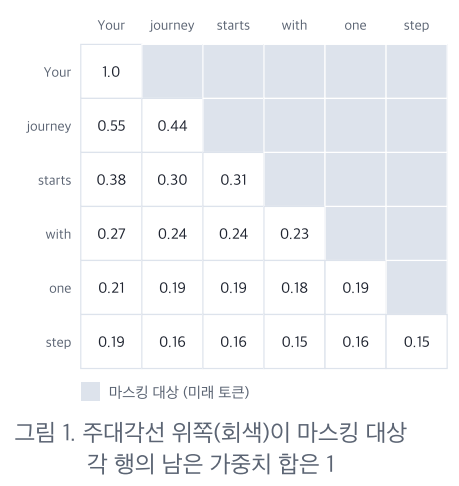
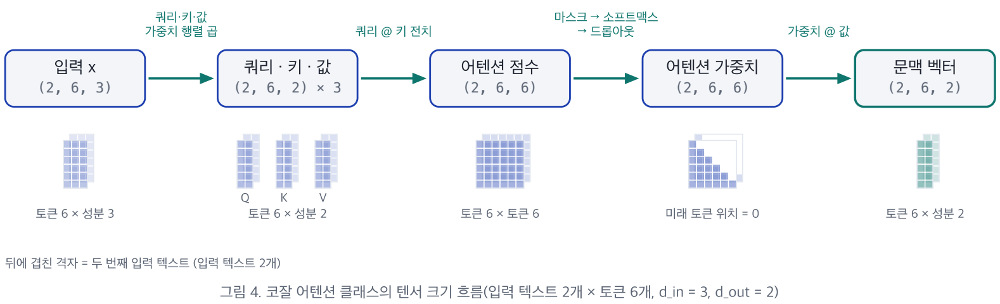
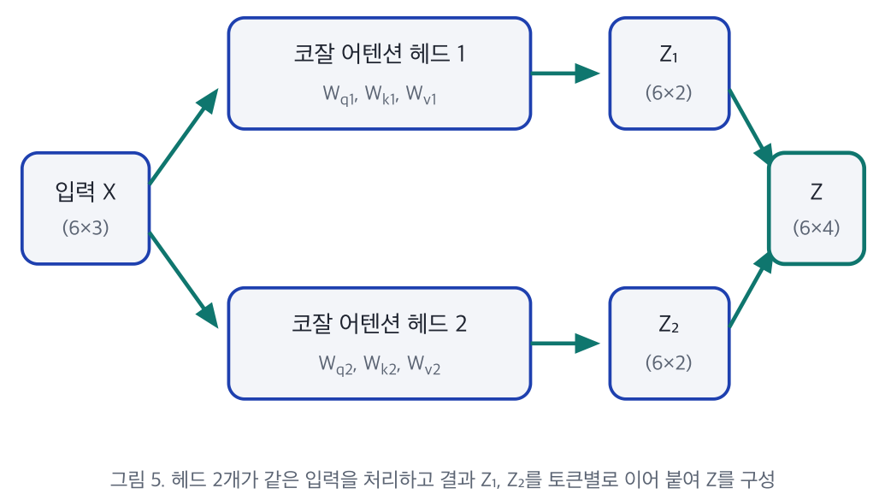
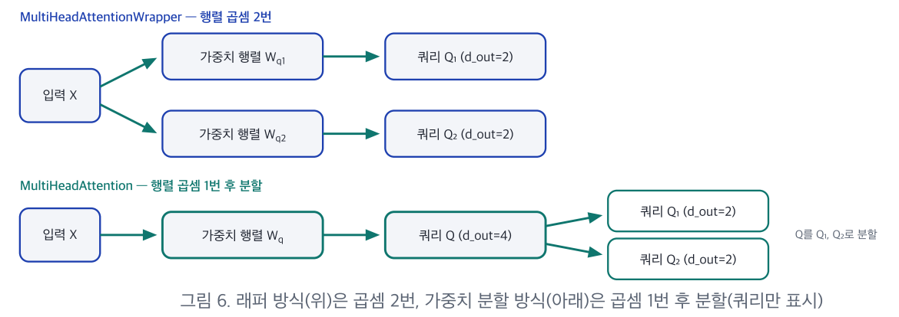
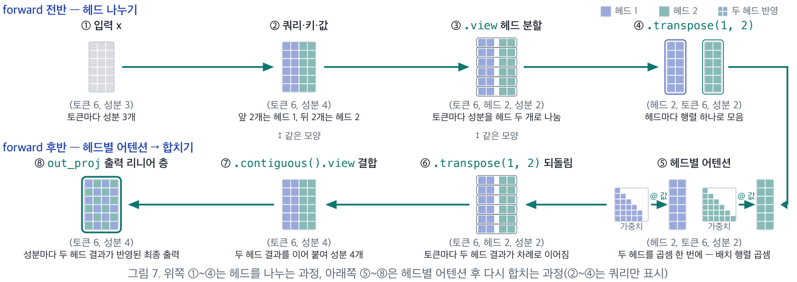
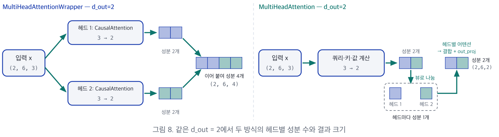

# 5장. 코잘 어텐션과 멀티 헤드 어텐션 (Causal & Multi-Head Attention)

> 컴퓨터특론 · *밑바닥부터 만들면서 배우는 LLM* (원서 3.5 ~ 3.6절)
> 원본: `5장_요약본.pdf`
> 이전 장: [4장. 셀프 어텐션](04-self_attention.md)

---

## 📌 목차

**Part 1. 코잘 어텐션**
1. [어텐션 구현 로드맵](#_1-어텐션-구현-로드맵-—-이번-장은-세-번째와-네-번째-단계)
2. [코잘 어텐션이 필요한 이유](#_2-코잘-어텐션이-필요한-이유)
3. [마스킹 후 재정규화](#_3-마스킹-후-재정규화-—-소프트맥스-→-0-마스킹-→-재정규화)
4. [−∞ 마스킹 후 소프트맥스](#_4-−∞-마스킹-후-소프트맥스-—-재정규화가-필요-없는-방법)

**Part 2. 드롭아웃과 코잘 어텐션 클래스**

5. [드롭아웃의 원리와 적용 위치](#_5-드롭아웃-—-무작위-마스킹으로-과대적합-줄이기)
6. [남은 값을 키우는 이유](#_6-남은-값을-키우는-이유-—-절반은-0-남은-값은-2배)
7. [배치 입력](#_7-배치-입력-—-배치-토큰-성분-순서의-3차원-텐서)
8. [코잘 어텐션의 계산 흐름](#_8-코잘-어텐션의-계산-흐름)
9. [구현의 핵심 개념 세 가지](#_9-구현의-핵심-개념-세-가지)

**Part 3. 멀티 헤드 어텐션**

10. [멀티 헤드의 개념](#_10-멀티-헤드의-개념-—-독립적인-어텐션-헤드-여러-개)
11. [래퍼 방식](#_11-래퍼-방식-—-코잘-어텐션을-헤드-수만큼-두기)
12. [가중치 분할 방식](#_12-가중치-분할-방식-—-큰-행렬-하나를-헤드로-나누기)
13. [나누기 → 헤드별 어텐션 → 합치기](#_13-나누기-→-헤드별-어텐션-→-합치기)
14. [두 방식 비교](#_14-두-방식-비교-—-같은-d-out-2-다른-결과)
15. [GPT-2의 실전 규모](#_15-실전-규모-—-gpt-2의-멀티-헤드-어텐션)

[요약](#_16-요약) · [퀴즈](#_17-셀프-체크-퀴즈)

> 💻 이번 장은 요약본만 있고 실습 노트북은 없다. 노트의 **🧪 실습** 코드는 원서(LLMs-from-scratch 3장) 코드를 그대로 옮긴 것이며, 4장 실습과 같은 입력·시드로 **직접 실행해 출력을 확인** 했다 (PyTorch 2.x, CPU).
>
> 📝 **[보충]** 이 붙은 내용은 요약본에 없지만 이해를 돕기 위해 추가한 설명이다.

### 🎯 학습 목표

- 다음 토큰을 예측할 때 **미래 토큰의 참조를 막아야 하는 이유** 와 코잘 어텐션의 원리
- 소프트맥스 **이전에** 음의 무한대($-\infty$)로 마스킹해, **재정규화 없이** 코잘 마스크를 적용하는 원리
- **드롭아웃** 이 과대적합을 줄이는 원리와 코잘 마스크와의 차이
- 배치 입력을 처리하는 코잘 어텐션 클래스(`CausalAttention`)의 계산 흐름
- 가중치 분할로 모든 헤드를 한 번에 계산하는 멀티 헤드 어텐션 클래스(`MultiHeadAttention`, **6장 GPT 모델에서 그대로 사용**)

### 이 장의 진행


---

# Part 1. 코잘 어텐션 — 미래 토큰을 가리는 셀프 어텐션

## 1. 어텐션 구현 로드맵 — 이번 장은 세 번째와 네 번째 단계

4장의 셀프 어텐션에 기능을 하나씩 더해 가는 네 단계 가운데, 이번 장은 **③ 코잘 어텐션** 과 **④ 멀티 헤드 어텐션** 을 다룬다.

| 버전 | 앞 버전에 더하는 것 | 다루는 장 |
|---|---|---|
| ① 간소화된 셀프 어텐션 | 훈련 가능한 가중치 없이 입력 벡터끼리의 점곱으로 계산 | 4장 |
| ② 셀프 어텐션 | 쿼리·키·값을 구하는 **훈련 가능한 가중치 행렬** | 4장 |
| **③ 코잘 어텐션** | 미래 토큰을 가리는 **코잘 마스크** + 과대적합을 줄이는 **드롭아웃** | **5장** |
| **④ 멀티 헤드 어텐션** | 코잘 어텐션을 **여러 개**(각각을 **헤드** 라 함) 두고 헤드별 결과를 **이어 붙임** | **5장** |

```
4장 SelfAttention_v2 ──(+ 코잘 마스크 + 드롭아웃 + 배치)──▶ CausalAttention
                                                              │
                                     (헤드 여러 개 + 가중치 분할 + out_proj)
                                                              ▼
                                                     MultiHeadAttention ──▶ 6장 GPT
```

---

## 2. 코잘 어텐션이 필요한 이유

> **코잘 어텐션 (causal attention)**: 현재 토큰보다 **뒤에 오는 미래 토큰을 가리는** 셀프 어텐션.
> 가릴 위치에 마스크를 적용하므로 **마스크드 어텐션(masked attention)** 이라고도 하며, 이때 쓰는 마스크를 **코잘 마스크(causal mask)** 라 한다.

### 2.1 참조 범위의 제한

| | 4장 셀프 어텐션 | 5장 코잘 어텐션 |
|---|---|---|
| 한 토큰의 문맥 벡터를 구할 때 참조 | 입력 토큰 **전체** | **현재 위치까지** |
| 문맥 벡터에 반영되는 정보 | 앞뒤 모든 토큰 | **자기 자신 + 이전 토큰** 만 |

### 2.2 제한하는 이유 ⭐

- 언어 모델은 각 위치에서 **바로 다음 토큰** 을 예측하도록 훈련된다 (1장, 3장).
- 미래 토큰까지 참조하면 **예측해야 할 정답을 입력으로 미리 보게** 되어, 다음 토큰을 예측하는 능력을 학습할 수 없다.
- 예: **둘째 위치의 정답은 셋째 토큰** 이므로, 둘째 토큰의 문맥 벡터에 셋째 토큰의 정보가 들어가면 안 된다.

```
입력:   Your  journey  starts  with  one  step
           │      │
           │      └─ 이 위치의 정답 = "starts"
           │         → "journey"의 문맥 벡터는 "Your", "journey"만 봐야 함
           └─ 이 위치의 정답 = "journey" → "Your"만 봐야 함
```

> 💡 **3장과 연결**: 3장에서 "타깃 뒤의 단어는 데이터 로더가 아니라 **어텐션의 인과적 마스크** 가 가린다"고 했던 바로 그 장치다. 데이터 로더는 입력 `x`와 타깃 `y`(한 칸 민 것)를 통째로 넘기고, 각 위치가 미래를 보지 못하게 막는 일은 코잘 마스크가 한다.

> 💡 **[보충] 시험 비유**: 문제지와 답안지를 같이 주면 학생은 문제를 푸는 법을 배우지 않고 답을 베낀다. 코잘 마스크는 **답안지(미래 토큰)를 가리는 가림판** 이다.

### 2.3 마스킹할 위치

어텐션 가중치 행렬에서 **행 = 문맥 벡터를 구하는 토큰**, **열 = 참조되는 토큰** 이다.

- 각 토큰이 자기 자신과 만나는 위치를 이은 대각선 = **주대각선**
- 각 행에서 주대각선의 **오른쪽 = 미래 토큰**
- → **주대각선 위쪽 전체가 마스킹 대상**



**그림 1의 값을 표로 옮기면** (░ = 마스킹 대상)

|  | Your | journey | starts | with | one | step |
|---|---|---|---|---|---|---|
| **Your** | 1.0 | ░ | ░ | ░ | ░ | ░ |
| **journey** | 0.55 | 0.44 | ░ | ░ | ░ | ░ |
| **starts** | 0.38 | 0.30 | 0.31 | ░ | ░ | ░ |
| **with** | 0.27 | 0.24 | 0.24 | 0.23 | ░ | ░ |
| **one** | 0.21 | 0.19 | 0.19 | 0.18 | 0.19 | ░ |
| **step** | 0.19 | 0.16 | 0.16 | 0.15 | 0.16 | 0.15 |

- 첫 행 `Your`는 자기 자신만 볼 수 있으므로 가중치가 **1.0**
- 마지막 행 `step`은 모든 토큰을 볼 수 있으므로 마스킹이 없다.

### 2.4 마스킹 후 정규화

일부 가중치를 가리면 **행의 합이 1보다 작아진다** → 남은 가중치의 합이 행마다 **다시 1** 이 되도록 정규화해야 한다. 그 방법이 두 가지(3절, 4절)다.

---

## 3. 마스킹 후 재정규화 — 소프트맥스 → 0 마스킹 → 재정규화

4장의 계산으로 어텐션 가중치를 구한 뒤, 미래 토큰의 가중치를 **0으로 바꾸고** 행마다 합을 **다시 1로 맞추는** 방법이다.

**실습 입력**: 4장과 같은 문장 "Your journey starts with one step"의 토큰 6개, 토큰마다 입력 벡터의 **성분(component)** 3개 → 어텐션 점수와 가중치는 **6행 6열**

> 💡 **성분**: 벡터에 담긴 값 하나하나. 4장의 "3차원 벡터" = 성분이 3개인 벡터


### ① 소프트맥스

쿼리와 키의 점곱으로 구한 점수를 **키 벡터 성분 수의 제곱근** 으로 나눈 뒤 행마다 소프트맥스를 적용한다 (4장 18절).

- 성분 수가 많을수록 점곱에서 더해지는 항이 많아져 점수가 커지고,
- 점수가 커지면 소프트맥스가 가중치를 **한 점수에 집중** 시켜 **그레이디언트**(가중치를 어느 방향으로 얼마나 고칠지 알려 주는 값)가 지나치게 작아지기 때문이다.
- ⚠️ 이 단계의 가중치에는 **미래 토큰도 반영** 되어 있다.

> ### 🧪 실습: 4장 SelfAttention_v2로 가중치 구하기
>
> ```python
> import torch
> import torch.nn as nn
>
> inputs = torch.tensor(
>   [[0.43, 0.15, 0.89],  # Your
>    [0.55, 0.87, 0.66],  # journey
>    [0.57, 0.85, 0.64],  # starts
>    [0.22, 0.58, 0.33],  # with
>    [0.77, 0.25, 0.10],  # one
>    [0.05, 0.80, 0.55]]) # step
> d_in, d_out = 3, 2
>
> torch.manual_seed(789)
> sa_v2 = SelfAttention_v2(d_in, d_out)       # 4장에서 만든 클래스
>
> queries = sa_v2.W_query(inputs)
> keys = sa_v2.W_key(inputs)
> attn_scores = queries @ keys.T
> attn_weights = torch.softmax(attn_scores / keys.shape[-1]**0.5, dim=-1)
> print(attn_weights)
> ```
>
> ```
> tensor([[0.1921, 0.1646, 0.1652, 0.1550, 0.1721, 0.1510],
>         [0.2041, 0.1659, 0.1662, 0.1496, 0.1665, 0.1477],
>         [0.2036, 0.1659, 0.1662, 0.1498, 0.1664, 0.1480],
>         [0.1869, 0.1667, 0.1668, 0.1571, 0.1661, 0.1564],
>         [0.1830, 0.1669, 0.1670, 0.1588, 0.1658, 0.1585],
>         [0.1935, 0.1663, 0.1666, 0.1542, 0.1666, 0.1529]])
> ```
>
> → 아직 모든 칸에 값이 있다 (미래 토큰 포함).

### ② 0 마스킹

**주대각선과 그 아래는 1, 위쪽은 0** 인 마스크(**하삼각 행렬**, lower triangular)를 가중치와 **같은 위치끼리 곱한다** (원소별 곱). 미래 토큰의 가중치만 0이 되며, 그 결과 **행의 합이 1보다 작아진다**.

> ### 🧪 실습
>
> ```python
> context_length = attn_scores.shape[0]                       # 6
> mask_simple = torch.tril(torch.ones(context_length, context_length))
> print(mask_simple)
> masked_simple = attn_weights * mask_simple
> print(masked_simple)
> ```
>
> ```
> mask_simple (하삼각, 1 = 남길 위치)        masked_simple
> [[1., 0., 0., 0., 0., 0.],                [[0.1921, 0.0000, 0.0000, ...],
>  [1., 1., 0., 0., 0., 0.],                 [0.2041, 0.1659, 0.0000, ...],   ← 합 0.37
>  [1., 1., 1., 0., 0., 0.],                 [0.2036, 0.1659, 0.1662, ...],
>  [1., 1., 1., 1., 0., 0.],                 ...
>  [1., 1., 1., 1., 1., 0.],
>  [1., 1., 1., 1., 1., 1.]]
> ```
>
> - `torch.tril` = **tri**angle **l**ower (하삼각)

### ③ 재정규화

각 가중치를 **자기 행의 합으로 나눈다**.

> ### 🧪 실습
>
> ```python
> row_sums = masked_simple.sum(dim=-1, keepdim=True)
> masked_simple_norm = masked_simple / row_sums
> print(masked_simple_norm)
> ```
>
> ```
> tensor([[1.0000, 0.0000, 0.0000, 0.0000, 0.0000, 0.0000],
>         [0.5517, 0.4483, 0.0000, 0.0000, 0.0000, 0.0000],
>         [0.3800, 0.3097, 0.3103, 0.0000, 0.0000, 0.0000],
>         [0.2758, 0.2460, 0.2462, 0.2319, 0.0000, 0.0000],
>         [0.2175, 0.1983, 0.1984, 0.1888, 0.1971, 0.0000],
>         [0.1935, 0.1663, 0.1666, 0.1542, 0.1666, 0.1529]])
> ```
>
> - 둘째 행: 0.2041 / (0.2041 + 0.1659) = **0.5517**, 0.1659 / 0.3700 = **0.4483** → 합 1 ✅
> - `keepdim=True`: 행 합을 `[6]`이 아니라 `[6, 1]` 모양으로 유지해서, 나눗셈 때 **각 행이 자기 합으로** 나뉘도록(브로드캐스팅) 한다. **[보충]**

### 정보 누수는 없다 ⭐

> **의문**: ①의 소프트맥스는 **미래 토큰의 점수까지 포함한 합** 으로 나눴다. 그러면 미래 정보가 섞인 것 아닌가?

**답: 섞이지 않는다.**

남은 가중치는 모두 **같은 합 $Z$** 로 나눈 값이므로, ③에서 다시 나누면 그 합이 **약분** 된다.

$$
\frac{e^{\omega_1}/Z}{\,e^{\omega_1}/Z + e^{\omega_2}/Z\,} = \frac{e^{\omega_1}}{e^{\omega_1} + e^{\omega_2}}
$$

여기서 $Z = e^{\omega_1} + e^{\omega_2} + \cdots + e^{\omega_6}$ (미래 토큰 점수 포함). 오른쪽은 **남은 위치의 점수만으로** 소프트맥스를 계산한 것과 같다. → 미래 토큰의 정보는 최종 가중치에 **남지 않는다**.

---

## 4. −∞ 마스킹 후 소프트맥스 — 재정규화가 필요 없는 방법

소프트맥스를 적용하기 **전에** 미래 토큰의 점수를 **음의 무한대** 로 바꾸면, 마스킹과 정규화가 **소프트맥스 한 번** 으로 끝난다.


### 원리

소프트맥스는 각 점수에 먼저 지수 함수를 적용하는데

$$
e^{-\infty} = 0
$$

이므로, 마스킹한 위치는 가중치가 **0** 이 되고 행의 합에도 **더해지지 않는다**. 따라서 남은 가중치의 합이 **처음부터 1** 이며, 결과는 3절의 방법과 같다.

> ### 🧪 실습
>
> ```python
> mask = torch.triu(torch.ones(context_length, context_length), diagonal=1)
> masked = attn_scores.masked_fill(mask.bool(), -torch.inf)
> print(masked)
>
> attn_weights = torch.softmax(masked / keys.shape[-1]**0.5, dim=-1)
> print(attn_weights)
> print(torch.allclose(attn_weights, masked_simple_norm))   # True
> ```
>
> ```
> masked (점수 단계):
> tensor([[0.2899,   -inf,   -inf,   -inf,   -inf,   -inf],
>         [0.4656, 0.1723,   -inf,   -inf,   -inf,   -inf],
>         [0.4594, 0.1703, 0.1731,   -inf,   -inf,   -inf],
>         [0.2642, 0.1024, 0.1036, 0.0186,   -inf,   -inf],
>         [0.2183, 0.0874, 0.0882, 0.0177, 0.0786,   -inf],
>         [0.3408, 0.1270, 0.1290, 0.0198, 0.1290, 0.0078]])
>
> attn_weights (소프트맥스 후):
> tensor([[1.0000, 0.0000, 0.0000, 0.0000, 0.0000, 0.0000],
>         [0.5517, 0.4483, 0.0000, 0.0000, 0.0000, 0.0000],
>         [0.3800, 0.3097, 0.3103, 0.0000, 0.0000, 0.0000],
>         [0.2758, 0.2460, 0.2462, 0.2319, 0.0000, 0.0000],
>         [0.2175, 0.1983, 0.1984, 0.1888, 0.1971, 0.0000],
>         [0.1935, 0.1663, 0.1666, 0.1542, 0.1666, 0.1529]])
> True
> ```
>
> → 3절 결과와 **완전히 같다**.

### 주의할 점

| 포인트 | 설명 |
|---|---|
| **마스크의 의미가 반대** | 이번 마스크는 주대각선을 제외한 **위쪽만 1** 인 **상삼각 행렬** (`torch.triu`, `diagonal=1`)이며, **1인 위치의 점수를 −∞로 채운다**. 3절 마스크의 1이 **남길** 위치였다면, 이 마스크의 1은 **가릴** 위치다 |
| **자기 자신은 가리지 않음** | `diagonal=1`이라 주대각선은 0 → 자기 자신은 가려지지 않는다 |
| **스케일링과의 순서** | $-\infty$ 는 제곱근으로 나눠도 $-\infty$ 이므로, **마스킹한 뒤 스케일링해도** 마스킹이 유지된다 |

```
torch.triu(ones, diagonal=1)        torch.tril(ones)
(1 = 가릴 위치)                      (1 = 남길 위치)
[[0, 1, 1, 1, 1, 1],                [[1, 0, 0, 0, 0, 0],
 [0, 0, 1, 1, 1, 1],                 [1, 1, 0, 0, 0, 0],
 [0, 0, 0, 1, 1, 1],                 [1, 1, 1, 0, 0, 0],
 [0, 0, 0, 0, 1, 1],                 [1, 1, 1, 1, 0, 0],
 [0, 0, 0, 0, 0, 1],                 [1, 1, 1, 1, 1, 0],
 [0, 0, 0, 0, 0, 0]]                 [1, 1, 1, 1, 1, 1]]
```

> 💡 **[보충] 왜 0이 아니라 −∞인가?** 점수를 0으로 바꾸면 $e^0 = 1$ 이 되어 오히려 가중치가 생긴다. 지수를 취했을 때 0이 되는 값은 $-\infty$ 뿐이다.

### 두 방법 비교 ⭐

| 구분 | 마스킹 후 재정규화 (3절) | −∞ 마스킹 (4절) |
|---|---|---|
| 마스킹 대상 | 소프트맥스를 **거친 가중치** | 소프트맥스를 **거치기 전의 점수** |
| 마스킹 값 | **0** | **−∞** |
| 마스크 | `torch.tril` — 1은 **남길** 위치 | `torch.triu(diagonal=1)` — 1은 **가릴** 위치 |
| 단계 수 | **3단계** (재정규화 필요) | **2단계** (소프트맥스가 정규화까지 처리) |
| 결과 | 같음 | 같음 |

이후에는 4장과 같이 이 가중치로 **값 벡터의 가중 합** 을 구해 문맥 벡터를 계산한다.

---

# Part 2. 드롭아웃과 코잘 어텐션 클래스

## 5. 드롭아웃 — 무작위 마스킹으로 과대적합 줄이기

> **드롭아웃 (dropout)**: **훈련 중에** 어텐션 가중치 일부를 **무작위로 0으로** 바꾸는 기법. 어텐션 가중치에 적용하는 **두 번째 마스크** 다.

### 5.1 과대적합을 줄이는 원리

- 모델이 **특정 토큰에만 의존** 하면 훈련 데이터에는 잘 맞지만 새로운 데이터에는 잘 맞지 않는 **과대적합(overfitting)** 이 생긴다.
- 드롭아웃으로 그 토큰의 가중치가 0이 되면 **예측 오차가 커지므로**, 모델은 **여러 토큰의 정보를 함께 활용** 하도록 학습되고 특정 토큰에 대한 의존이 줄어든다.

> 💡 **[보충] 팀 프로젝트 비유**: 매번 무작위로 팀원 몇 명이 결석한다면, 팀은 에이스 한 명에게만 의존할 수 없고 모두가 역할을 나눠 맡게 된다.

### 5.2 훈련 중에만 적용

일부 가중치가 0이 되어도 예측할 수 있게 **학습시키는** 기법이므로, 학습을 마친 모델로 답을 생성하는 **추론 단계에서는 비활성화** 한다.

1. 추론에서는 참조할 수 있는 토큰의 정보를 **모두 활용** 해야 한다.
2. 가중치를 무작위로 제외하면 **같은 입력에도 매번 다른 출력** 이 나온다.

> 💡 **[보충]** PyTorch에서는 `model.train()` / `model.eval()` 로 전환한다. `eval()` 모드에서는 `nn.Dropout`이 아무것도 하지 않는다.

### 5.3 드롭아웃 비율

| 상황 | 비율 |
|---|---|
| 너무 높으면 | 정보가 지나치게 제외되어 **학습이 어려워짐** |
| GPT 훈련 | **10%** 나 **20%** |
| 이번 실습 | **50%** (0이 되는 값과 남는 값을 비교하기 쉽도록) |
| 적절한 값 | 모델과 데이터에 따라 다름 |

### 5.4 적용 위치 (GPT를 포함한 트랜스포머)

| 적용 위치 | 0이 되는 대상 | 효과 |
|---|---|---|
| **어텐션 가중치를 계산한 직후** (이번 실습) | 가중치 일부 | 그 토큰의 값 벡터에 0이 곱해져, 해당 문맥 벡터 계산에서 그 토큰의 **정보가 제외** 됨 |
| 문맥 벡터를 계산한 직후 | 문맥 벡터의 성분 일부 | 문맥 벡터의 **일부 성분만** 제외됨 |

---

## 6. 남은 값을 키우는 이유 — 절반은 0, 남은 값은 2배

### 6.1 0이 되는 위치

값마다 0이 될지 **독립적으로** 정해지므로, 비율이 50%라도 한 행에서 **정확히 절반** 이 0이 된다는 보장은 없다. 50%는 여러 번 반복했을 때의 **평균** 이다.

### 6.2 평균 유지 ⭐

> ### 🧪 실습: 1로 채운 6×6 행렬에 드롭아웃
>
> ```python
> torch.manual_seed(123)
> dropout = torch.nn.Dropout(0.5)     # 비율 50%
> example = torch.ones(6, 6)
> print(dropout(example))
> ```
>
> ```
> tensor([[2., 2., 0., 2., 2., 0.],
>         [0., 0., 0., 2., 0., 2.],
>         [2., 2., 2., 2., 0., 2.],
>         [0., 2., 2., 0., 0., 2.],
>         [0., 2., 0., 2., 0., 2.],
>         [0., 2., 2., 2., 2., 0.]])
> ```
>
> - 남은 값이 1이 아니라 **2** 다.
> - 행마다 0의 개수가 다르다 (첫 행 2개, 둘째 행 4개) → 6.1의 "정확히 절반이 보장되지 않음"

**왜 2인가?**

- 남은 값을 1로 두면, 한 행의 합이 평균적으로 **6 → 3** 으로 줄어든다.
- 그래서 남은 값을 **남을 확률 0.5로 나눠 2로** 키운다 → 합이 평균적으로 **다시 6**
- 일반적으로 비율이 $p$ 이면 남은 값에 $\frac{1}{1-p}$ 를 곱한다.
- 추론에서는 드롭아웃을 끄므로 합이 그대로 6 → **훈련과 추론에서 값의 평균 크기가 같아진다**.

| 비율 $p$ | 남은 값에 곱하는 수 $\frac{1}{1-p}$ |
|---|---|
| 0.1 | 약 1.11 |
| 0.2 | 1.25 |
| 0.5 | 2 |

> 💡 **[보충]** 이 방식을 **역 드롭아웃(inverted dropout)** 이라 한다. 훈련 때 미리 키워 두므로 추론 때는 아무 보정도 하지 않아도 된다.

### 6.3 어텐션 가중치에 적용한 결과

> ### 🧪 실습
>
> ```python
> torch.manual_seed(123)
> print(dropout(attn_weights))   # 4절의 마스킹된 가중치에 적용
> ```
>
> ```
> tensor([[2.0000, 0.0000, 0.0000, 0.0000, 0.0000, 0.0000],
>         [0.0000, 0.0000, 0.0000, 0.0000, 0.0000, 0.0000],
>         [0.7599, 0.6194, 0.6206, 0.0000, 0.0000, 0.0000],
>         [0.0000, 0.4921, 0.4925, 0.0000, 0.0000, 0.0000],
>         [0.0000, 0.3966, 0.0000, 0.3775, 0.0000, 0.0000],
>         [0.0000, 0.3327, 0.3331, 0.3084, 0.3331, 0.0000]])
> ```
>
> - 코잘 마스크로 이미 0인 위치 외에 **드롭아웃으로 0이 된 위치** 가 생기고, 남은 가중치는 **두 배** 가 된다 (예: 셋째 행 0.3800 → 0.7599).
> - 행의 합이 **1이 아닐 수 있다** (첫 행 2.0, 둘째 행 0). 이것은 오류가 아니라 **평균을 유지하려고 남은 값을 키운 결과** 다.
> - ⚠️ 같은 시드에서는 같은 위치가 0이 되지만, **운영체제나 PyTorch 버전에 따라 결과가 다를 수 있다**. 직접 실행한 결과가 위와 다르더라도 정상이다.

### 6.4 코잘 마스크 vs 드롭아웃 마스크 ⭐⭐

둘 다 어텐션 가중치를 0으로 바꾸지만, **목적과 위치를 정하는 방식** 이 다르다.

| 구분 | 코잘 마스크 | 드롭아웃 마스크 |
|---|---|---|
| **목적** | 정답인 **미래 토큰의 참조 차단** | 특정 토큰에 대한 **의존을 줄여 과대적합 완화** |
| **0이 되는 위치** | **토큰 순서만으로** 결정 — 입력 텍스트가 달라도 같은 위치 | 계산할 때마다 **무작위** 로 결정 |
| **적용 시점** | **훈련과 추론 모두** | **훈련 중에만** |
| 남은 값 | 그대로 (재정규화로 합 1) | $\frac{1}{1-p}$ 배로 키움 |

> ⚠️ 추론에서도 **코잘 마스크는 계속 적용** 되므로, 현재 토큰은 자기 자신과 이전 토큰만 참조한다. (생성할 때는 애초에 미래 토큰이 없지만, 입력 프롬프트를 한 번에 처리할 때도 각 위치는 앞만 본다.)

---

## 7. 배치 입력 — (배치, 토큰, 성분) 순서의 3차원 텐서

실제 훈련에서는 **데이터 로더**(3장)가 입력 텍스트 여러 개를 **배치** 로 구성하고, 이 배치가 임베딩 층을 거쳐 어텐션에 전달된다. 따라서 어텐션 클래스는 입력 텍스트 하나가 아니라 **배치를 입력받아야** 한다.

### 3차원 텐서의 각 차원

| 차원 | 이름 | 의미 | 실습 크기 |
|---|---|---|---|
| 첫째 (0) | **배치 차원** | 몇 번째 입력 텍스트인지 | 2 |
| 둘째 (1) | **토큰 차원** | 몇 번째 토큰인지 | 6 |
| 셋째 (2) | **성분 차원** | 몇 번째 성분인지 | 3 |

- 입력 텍스트와 토큰을 지정하면 **입력 벡터 하나** 가 나온다. 예: `batch[0, 1]` = 첫 번째 텍스트의 둘째 토큰(journey)의 벡터

> ### 🧪 실습: 배치 구성
>
> ```python
> batch = torch.stack((inputs, inputs), dim=0)
> print(batch.shape)   # torch.Size([2, 6, 3])
> ```
>
> - 입력 텍스트가 하나뿐이므로 **같은 행렬(토큰 6 × 성분 3)을 두 번 쌓아** 크기 (2, 6, 3)인 배치를 만든다.
> - `torch.stack`은 **새 차원을 추가해 쌓으므로** 두 입력 텍스트가 **구분된 채** 유지된다.
> - **[보충]** `torch.cat((inputs, inputs), dim=0)` 은 이어 붙여서 (12, 3)이 된다 → 두 텍스트의 경계가 사라짐

```
torch.stack → (2, 6, 3)              torch.cat → (12, 3)
┌─ 텍스트 0 ─┐                        ┌──────────┐
│ 6 × 3     │                        │ 6 × 3    │
└───────────┘                        │ 6 × 3    │  ← 한 덩어리
┌─ 텍스트 1 ─┐                        └──────────┘
│ 6 × 3     │
└───────────┘
```

이후의 모든 어텐션 클래스는 이 순서의 3차원 텐서를 입력받아, 배치 안의 입력 텍스트마다 **같은 어텐션 계산을 독립적으로** 수행한다.

---

## 8. 코잘 어텐션의 계산 흐름

4장의 두 번째 셀프 어텐션 클래스(`SelfAttention_v2`)에 **드롭아웃** 과 **코잘 마스크** 를 더한 구성이다. 입력 벡터의 성분 수를 `d_in`, 쿼리·키·값 벡터의 성분 수를 `d_out`이라 하며, 실습에서는 4장과 같이 **3** 과 **2** 로 둔다.



| 단계 | 하는 일 | 크기 변화 |
|---|---|---|
| **쿼리·키·값** | 모든 입력 벡터에 쿼리·키·값 가중치 행렬을 곱해, 성분 3개 → 성분 2개로 변환 | (2, 6, 3) → (2, 6, 2) ×3 |
| **어텐션 점수** | 입력 텍스트마다 모든 쿼리와 모든 키를 점곱. 쿼리 하나를 키 6개와 점곱하므로 행도 토큰, 열도 토큰 | → (2, 6, 6) |
| **어텐션 가중치** | 코잘 마스크(−∞) → 스케일링·소프트맥스 → 드롭아웃 | (2, 6, 6) 유지 |
| **문맥 벡터** | 가중치 한 행의 비율대로 값 벡터 6개를 더해, 토큰마다 성분 2개 | → (2, 6, 2) |

> 💡 **입력 텍스트 수 2와 토큰 수 6은 끝까지 유지되고, 성분 수만 3에서 2로 바뀐다.** 입력 텍스트끼리는 서로의 계산에 관여하지 않고, 토큰마다 결과가 하나씩 나오기 때문이다.

> ### 🧪 실습: CausalAttention 클래스
>
> ```python
> class CausalAttention(nn.Module):
>     def __init__(self, d_in, d_out, context_length, dropout, qkv_bias=False):
>         super().__init__()
>         self.d_out = d_out
>         self.W_query = nn.Linear(d_in, d_out, bias=qkv_bias)
>         self.W_key   = nn.Linear(d_in, d_out, bias=qkv_bias)
>         self.W_value = nn.Linear(d_in, d_out, bias=qkv_bias)
>         self.dropout = nn.Dropout(dropout)                       # ★ 드롭아웃
>         self.register_buffer(                                    # ★ 코잘 마스크 (버퍼)
>             "mask",
>             torch.triu(torch.ones(context_length, context_length), diagonal=1)
>         )
>
>     def forward(self, x):
>         b, num_tokens, d_in = x.shape                            # ★ 배치 입력
>         keys    = self.W_key(x)
>         queries = self.W_query(x)
>         values  = self.W_value(x)
>
>         attn_scores = queries @ keys.transpose(1, 2)             # ★ .T 대신 transpose(1, 2)
>         attn_scores.masked_fill_(                                # ★ 인플레이스 −∞ 마스킹
>             self.mask.bool()[:num_tokens, :num_tokens], -torch.inf)
>         attn_weights = torch.softmax(
>             attn_scores / keys.shape[-1]**0.5, dim=-1)
>         attn_weights = self.dropout(attn_weights)                # ★ 드롭아웃
>
>         context_vec = attn_weights @ values
>         return context_vec
>
> torch.manual_seed(123)
> context_length = batch.shape[1]                    # 6
> ca = CausalAttention(d_in, d_out, context_length, 0.0)
> context_vecs = ca(batch)
> print(context_vecs)
> print("context_vecs.shape:", context_vecs.shape)
> ```
>
> ```
> tensor([[[-0.4519,  0.2216],
>          [-0.5874,  0.0058],
>          [-0.6300, -0.0632],
>          [-0.5675, -0.0843],
>          [-0.5526, -0.0981],
>          [-0.5299, -0.1081]],
>
>         [[-0.4519,  0.2216],
>          [-0.5874,  0.0058],
>          [-0.6300, -0.0632],
>          [-0.5675, -0.0843],
>          [-0.5526, -0.0981],
>          [-0.5299, -0.1081]]])
> context_vecs.shape: torch.Size([2, 6, 2])
> ```
>
> - 같은 텍스트를 두 번 넣었으므로 두 결과가 **같다**.
> - 드롭아웃 비율을 `0.0`으로 둬서 결과가 매번 같게 했다.

**SelfAttention_v2 → CausalAttention 변경점 (★ 표시)**

| 변경 | 이유 |
|---|---|
| `context_length`, `dropout` 인자 추가 | 마스크 크기, 드롭아웃 비율 |
| `register_buffer("mask", ...)` | 9절 ① |
| `b, num_tokens, d_in = x.shape` | 배치 입력 처리 |
| `keys.T` → `keys.transpose(1, 2)` | 9절 ③ |
| `masked_fill_(..., -torch.inf)` | 4절 −∞ 마스킹 (인플레이스) |
| `self.dropout(attn_weights)` | 5절 드롭아웃 |

---

## 9. 구현의 핵심 개념 세 가지

### ① 마스크는 학습 대상이 아닌 고정 텐서 → 버퍼

- 코잘 마스크는 미래 토큰을 차단하는 **규칙** 이므로, 가중치 행렬과 달리 **훈련으로 바뀌면 안 된다**.
- 한 연산에 쓰는 텐서는 **모두 같은 장치**(CPU/GPU)에 있어야 하므로, 모델을 GPU로 옮길 때 **마스크도 함께 옮겨져야** 한다.
- 이 두 조건을 만족하도록 마스크를 **버퍼**(`register_buffer`)로 등록한다.

| 종류 | 훈련으로 바뀜? | `model.to("cuda")` 때 함께 이동? | `state_dict` 저장? | 예 |
|---|---|---|---|---|
| 파라미터 (`nn.Parameter`, `nn.Linear`) | ✅ | ✅ | ✅ | `W_query.weight` |
| **버퍼** (`register_buffer`) | ❌ | ✅ | ✅ | `mask` |
| 일반 속성 (`self.mask = ...`) | ❌ | ❌ ← 장치 불일치 오류! | ❌ | |

> 🧪 실행 확인: `ca.named_buffers()` → `['mask']`, `ca.named_parameters()` → `['W_query.weight', 'W_key.weight', 'W_value.weight']` — 마스크는 **파라미터가 아니라 버퍼** 다.

### ② 마스크는 한 번만 생성

- 입력 텍스트 하나의 **최대 토큰 수(`context_length`) 크기** 로 미리 생성해 두고, 실제 토큰 수만큼 **왼쪽 위 부분만 슬라이싱** 해 사용한다: `self.mask.bool()[:num_tokens, :num_tokens]`
- 최대 토큰 수 이내라면 입력 길이가 달라도 **같은 마스크** 로 처리한다.

```
context_length = 6 으로 만든 마스크       num_tokens = 4 인 입력
[[0,1,1,1,1,1],                           [[0,1,1,1],
 [0,0,1,1,1,1],      [:4, :4] 슬라이싱      [0,0,1,1],
 [0,0,0,1,1,1],      ─────────────────▶     [0,0,0,1],
 [0,0,0,0,1,1],                             [0,0,0,0]]
 [0,0,0,0,0,1],
 [0,0,0,0,0,0]]
```

- 마스킹은 점수 텐서를 새로 만들지 않고 **직접 수정하는 인플레이스 연산**(`masked_fill_`, 이름 끝의 `_`)으로 처리해 **메모리 복사를 줄인다**.

| 함수 | 동작 |
|---|---|
| `masked_fill(...)` (4절) | **새 텐서** 를 만들어 반환 |
| `masked_fill_(...)` (클래스) | **원래 텐서를 수정** (PyTorch에서 `_`로 끝나는 메서드는 인플레이스) |

### ③ 행렬 곱셈은 마지막 두 차원에 적용

- 3차원 텐서끼리 행렬 곱셈을 하면 **마지막 두 차원을 행렬** 로 보고, 앞의 배치 차원은 **행렬을 가리키는 인덱스** 로 쓴다.
- 그래서 키를 전치할 때는 **토큰 차원과 성분 차원만** 바꾸고(`transpose(1, 2)`) 배치 차원은 그대로 둔다.
- 모든 차원의 순서를 뒤집는 `.T`는 **배치 차원까지** 옮기므로 쓰지 않는다.

```
queries          @  keys.transpose(1, 2)   =   attn_scores
(2, 6, 2)           (2, 2, 6)                  (2, 6, 6)
 │  └─┬─┘            │  └─┬─┘                   │  └─┬─┘
 │   행렬            │   행렬                   │   행렬
 └ 배치 인덱스        └ 배치 인덱스               └ 텍스트마다 6×6

keys.T 를 쓰면?  (b, n, d) → (d, n, b) — 모든 축이 뒤집혀 배치 차원이 맨 뒤로 가 버림 ❌
                  (이 실습은 b = d = 2 라서 모양은 우연히 같아 보여도 내용이 뒤섞인다)
```

---

# Part 3. 멀티 헤드 어텐션 — 코잘 어텐션을 여러 헤드로 확장하기

## 10. 멀티 헤드의 개념 — 독립적인 어텐션 헤드 여러 개

> **멀티 헤드 어텐션 (multi-head attention)**: 같은 입력을 **여러 헤드가 각자 독립적으로** 처리한 뒤 결과를 **하나로 합치는** 구조.
> 코잘 어텐션 하나가 **헤드 하나** 에 해당하며, 헤드가 하나뿐인 어텐션을 **싱글 헤드 어텐션** 이라 한다.



| 개념 | 설명 |
|---|---|
| **헤드마다 다른 가중치 행렬** | 쿼리·키·값 가중치 행렬을 헤드마다 **따로** 가지므로, 같은 입력이라도 헤드마다 쿼리·키·값이 다르고 어텐션 가중치와 문맥 벡터도 달라진다. 헤드가 두 개면 어텐션 가중치도 **두 세트** |
| **선형 투영** | 입력 벡터에 가중치 행렬을 곱해 쿼리·키·값을 구하는 연산(4장의 투영). 헤드마다 가중치 행렬이 **무작위로 초기화** 되어 처음부터 다르므로, 함께 훈련해도 **서로 다른 값으로 학습** 된다 |
| **결과 연결** | 두 헤드의 문맥 벡터(각각 토큰 6 × 성분 2)를 **같은 토큰끼리** 이어 붙이면 성분 4개. 최종 성분 수 = **헤드 하나의 성분 수 × 헤드 수** |

> 즉, 멀티 헤드 어텐션은 **서로 다르게 학습되는 선형 투영으로 같은 입력에 어텐션을 여러 번 수행** 하는 구조다.

### 얻는 것과 비용

- **비용**: 헤드를 추가하면 **계산량이 늘어난다**.
- **얻는 것**: 헤드마다 다른 관점으로 계산한 결과를 모아 **토큰 사이의 다양한 관계** 를 반영할 수 있다.
  - 예: 한 헤드는 **바로 이전 토큰** 에, 다른 헤드는 **멀리 떨어진 토큰** 에 높은 가중치를 두도록 학습될 수 있다.

> 💡 **[보충] 비유**: 같은 문장을 여러 명의 전문가가 각자 다른 관점(문법, 의미, 지시 대상 등)으로 읽고, 의견을 모아 종합하는 것과 같다. 예를 들어 "그 서버는 요청을 처리하지 못했다. **그것** 이 과부하 상태였기 때문이다"에서 한 헤드는 "그것 → 서버"(지시 대상)에, 다른 헤드는 "그것 → 과부하"(서술 관계)에 집중할 수 있다.

---

## 11. 래퍼 방식 — 코잘 어텐션을 헤드 수만큼 두기

이미 구현한 코잘 어텐션 클래스를 헤드 수만큼 생성해 **감싸는(wrap)** 클래스(`MultiHeadAttentionWrapper`)다. 이 클래스에서 `d_out`은 **헤드 하나의** 문맥 벡터 성분 수다.

> ### 🧪 실습
>
> ```python
> class MultiHeadAttentionWrapper(nn.Module):
>     def __init__(self, d_in, d_out, context_length, dropout, num_heads, qkv_bias=False):
>         super().__init__()
>         self.heads = nn.ModuleList(
>             [CausalAttention(d_in, d_out, context_length, dropout, qkv_bias)
>              for _ in range(num_heads)]
>         )
>
>     def forward(self, x):
>         return torch.cat([head(x) for head in self.heads], dim=-1)
>
> torch.manual_seed(123)
> mha = MultiHeadAttentionWrapper(d_in, d_out, context_length, 0.0, num_heads=2)
> context_vecs = mha(batch)
> print(context_vecs)
> print("context_vecs.shape:", context_vecs.shape)
> ```
>
> ```
> tensor([[[-0.4519,  0.2216,  0.4772,  0.1063],
>          [-0.5874,  0.0058,  0.5891,  0.3257],
>          [-0.6300, -0.0632,  0.6202,  0.3860],
>          [-0.5675, -0.0843,  0.5478,  0.3589],
>          [-0.5526, -0.0981,  0.5321,  0.3428],
>          [-0.5299, -0.1081,  0.5077,  0.3493]],
>
>         [[...같은 값...]]])
> context_vecs.shape: torch.Size([2, 6, 4])
>          └ 헤드 1 ┘  └ 헤드 2 ┘
> ```

| 포인트 | 설명 |
|---|---|
| **`nn.ModuleList`** | 헤드들을 모듈 리스트에 담아야 PyTorch가 각 헤드를 **모델의 일부로 등록** → 헤드의 가중치 행렬이 훈련 대상에 포함되고 GPU로 함께 옮겨진다. 일반 파이썬 리스트에 담으면 등록되지 않는다 **[보충]** |
| **계산** | 입력을 헤드에 차례로 전달하고, 헤드별 결과를 **마지막 차원(성분 차원)** 을 따라 이어 붙인다 (`torch.cat(..., dim=-1)`) |
| **결과 크기** | 입력 텍스트 2개, 토큰 6개, d_out = 2, 헤드 2개 → **(2, 6, 4)**. 한 행의 **앞 두 성분은 첫째 헤드, 뒤 두 성분은 둘째 헤드** 의 결과 |
| **헤드마다 다른 초깃값** | 난수 시드를 고정해도 헤드를 **차례로 생성** 하면서 앞 헤드에 이어지는 난수를 쓰므로, 두 헤드의 가중치 행렬은 **다른 값** 으로 초기화된다 |

> 💡 **관찰**: 앞 두 성분 `[-0.4519, 0.2216]`은 8절 `CausalAttention` 결과와 **똑같다**. 같은 시드(123)로 시작해서 첫 헤드가 같은 가중치로 초기화되었기 때문이다. 뒤 두 성분은 이어지는 난수로 만든 둘째 헤드의 결과다.

### 래퍼 방식의 한계

구조는 단순하지만 **헤드를 하나씩 차례로 계산** 하므로(`for head in self.heads`), 헤드가 늘어날수록 **계산 횟수도 늘어난다**.

---

## 12. 가중치 분할 방식 — 큰 행렬 하나를 헤드로 나누기

헤드마다 따로 두던 가중치 행렬을 **큰 행렬 하나로 통합** 하고, 한 클래스(`MultiHeadAttention`) 안에서 **모든 헤드를 함께** 계산하는 방식이다.



| 포인트 | 설명 |
|---|---|
| **큰 가중치 행렬** | 두 헤드의 쿼리 가중치 행렬을 **이어 붙인 것과 같다** → 행렬은 하나여도 **헤드마다 쓰는 가중치는 여전히 다르다** |
| **분할** | 큰 행렬을 입력에 한 번 곱하면 토큰마다 성분 4개(헤드 2개 × 성분 2개)인 쿼리가 나오고, **앞 2개는 첫째 헤드, 뒤 2개는 둘째 헤드** 가 사용한다. 헤드 하나가 받는 쿼리는 래퍼 방식과 같은 성분 2개 |
| **효율** | 행렬 곱셈은 계산 비용이 큰 연산이다. **작은 곱셈 여러 번을 큰 곱셈 한 번으로** 대체하므로, 헤드 수와 관계없이 쿼리·키·값마다 곱셈이 한 번씩, **모두 세 번** |
| **`d_out`의 의미** | 이 클래스에서는 **모든 헤드를 합친** 성분 수. 헤드 하나의 성분 수 `head_dim = d_out ÷ num_heads` → `d_out`은 헤드 수로 **나누어떨어져야** 한다. 헤드 수를 늘려도 최종 성분 수는 `d_out` 그대로 |

$$
W_q = \big[\, W_{q1} \;\big|\; W_{q2} \,\big] \quad (3 \times 4) \qquad\Rightarrow\qquad X W_q = \big[\, X W_{q1} \;\big|\; X W_{q2} \,\big] = \big[\, Q_1 \;\big|\; Q_2 \,\big]
$$

> 💡 행렬을 열 방향으로 이어 붙여 곱한 결과는, 각각 곱한 결과를 이어 붙인 것과 같다. 그래서 **결과는 같고 곱셈 횟수만 줄어든다**.

---

## 13. 나누기 → 헤드별 어텐션 → 합치기

입력 텍스트 하나, 토큰 6개, d_out = 4, 헤드 2개 기준이다. 실제 텐서에는 맨 앞에 **배치 차원** 이 하나 더 있다.

### 전체 흐름 (그림 7)



> 그림 7. 위쪽 ①~④는 헤드를 나누는 과정, 아래쪽 ⑤~⑧은 헤드별 어텐션 후 다시 합치는 과정 (②~④는 쿼리만 표시)

**배치 차원까지 포함한 실제 크기** (입력 텍스트 b개)

| 단계 | 코드 | 크기 |
|---|---|---|
| ① 입력 | `x` | (b, 6, 3) |
| ② 쿼리 | `self.W_query(x)` | (b, 6, 4) |
| ③ 분할 | `.view(b, num_tokens, num_heads, head_dim)` | (b, 6, 2, 2) |
| ④ 헤드 앞으로 | `.transpose(1, 2)` | (b, **2**, 6, 2) |
| ⑤ 점수 | `queries @ keys.transpose(2, 3)` | (b, 2, 6, 6) |
| ⑤ 문맥 | `attn_weights @ values` | (b, 2, 6, 2) |
| ⑥ 되돌림 | `.transpose(1, 2)` | (b, 6, 2, 2) |
| ⑦ 결합 | `.contiguous().view(b, num_tokens, d_out)` | (b, 6, 4) |
| ⑧ 출력 층 | `self.out_proj(...)` | (b, 6, 4) |

### 단계별 설명

**나누기 (②~④)**
- 성분 차원(4)을 **헤드 차원(2)과 헤드별 성분 차원(2)** 으로 분할하고(`view`), 헤드 차원을 **토큰 차원 앞으로** 옮긴다(`transpose`).
- 그 결과 **헤드마다 토큰 6 × 성분 2 행렬** 이 하나씩 구성된다.
- `view`는 성분의 순서는 그대로 두고 **각 차원의 크기만 다시 정하므로** 데이터를 복사하지 않는다.

```
토큰 t의 쿼리 (성분 4):  [ q₀  q₁ | q₂  q₃ ]
.view(…, 2, 2) 후:       [[q₀, q₁],   ← 헤드 1
                          [q₂, q₃]]   ← 헤드 2
```

**헤드별 어텐션 (⑤)**
- 행렬 곱셈은 **마지막 두 차원을 행렬** 로 보고, 앞의 **배치 차원과 헤드 차원은 행렬을 가리키는 인덱스** 로 쓴다 (9절 ③의 확장).
- 토큰 차원과 성분 차원을 맨 뒤에 두었으므로, **헤드를 하나씩 계산하지 않아도 곱셈 한 번으로 모든 헤드의 어텐션** 이 함께 계산된다.
- 점수는 `√head_dim` 으로 나눈다. 점곱에서 더해지는 항의 수가 **헤드 하나의 성분 수** 이기 때문이다.

> ### 🧪 [보충] 실습: 4차원 배치 행렬 곱셈이 헤드별 곱셈과 같은지 확인
>
> ```python
> # (배치 1, 헤드 2, 토큰 3, 성분 4)
> a = torch.tensor([[[[0.2745, 0.6584, 0.2775, 0.8573],
>                     [0.8993, 0.0390, 0.9268, 0.7388],
>                     [0.7179, 0.7058, 0.9156, 0.4340]],
>                    [[0.0772, 0.3565, 0.1479, 0.5331],
>                     [0.4066, 0.2318, 0.4545, 0.9737],
>                     [0.4606, 0.5159, 0.4220, 0.5786]]]])
>
> print(a @ a.transpose(2, 3))          # 모든 헤드를 한 번에
>
> first_head = a[0, 0, :, :]
> print(first_head @ first_head.T)      # 첫 헤드만 따로
> ```
>
> ```
> tensor([[[[1.3208, 1.1631, 1.2879],
>           [1.1631, 2.2150, 1.8424],
>           [1.2879, 1.8424, 2.0402]],     ← 첫 헤드 결과
>          [[0.4391, 0.7003, 0.5903],
>           [0.7003, 1.3737, 1.0620],
>           [0.5903, 1.0620, 0.9912]]]])   ← 둘째 헤드 결과
>
> tensor([[1.3208, 1.1631, 1.2879],
>         [1.1631, 2.2150, 1.8424],
>         [1.2879, 1.8424, 2.0402]])       ← 첫 헤드만 따로 계산해도 같음
> ```

**합치기 (⑥~⑦)**
- 헤드 차원을 다시 **토큰 차원 뒤로** 옮기면 한 행에 두 헤드의 성분이 차례로 이어지고, 두 차원을 하나로 합쳐 **성분 4개로 되돌린다**.
- 전치는 메모리에 저장된 순서를 그대로 둔 채 **읽는 순서만 바꾸므로**, 합치기 전에 현재 차원 순서대로 메모리에 **다시 저장** 한다(`contiguous`).
- **[보충]** `contiguous()` 없이 전치된 텐서에 `view`를 쓰면 `RuntimeError: view size is not compatible with input tensor's size and stride` 오류가 난다. (`reshape`는 필요하면 알아서 복사한다.)

**출력 리니어 층 (⑧)**
- ⑦까지는 첫째 헤드의 결과가 **앞 두 성분에만**, 둘째 헤드의 결과가 **뒤 두 성분에만** 있다.
- 출력 리니어 층(`out_proj`)은 성분 4개를 입력받아 성분 4개를 출력하며, 각 출력 성분은 **입력 성분 4개의 가중 합** 이므로 **성분마다 두 헤드의 결과가 모두 반영** 된다.
- 필수는 아니지만 LLM 구조에서 **널리 쓰인다**.

> ### 🧪 실습: MultiHeadAttention 클래스 (6장 GPT에서 그대로 사용)
>
> ```python
> class MultiHeadAttention(nn.Module):
>     def __init__(self, d_in, d_out, context_length, dropout, num_heads, qkv_bias=False):
>         super().__init__()
>         assert (d_out % num_heads == 0), "d_out must be divisible by num_heads"
>
>         self.d_out = d_out
>         self.num_heads = num_heads
>         self.head_dim = d_out // num_heads          # 헤드 하나의 성분 수
>         self.W_query = nn.Linear(d_in, d_out, bias=qkv_bias)
>         self.W_key   = nn.Linear(d_in, d_out, bias=qkv_bias)
>         self.W_value = nn.Linear(d_in, d_out, bias=qkv_bias)
>         self.out_proj = nn.Linear(d_out, d_out)     # ⑧ 출력 리니어 층
>         self.dropout = nn.Dropout(dropout)
>         self.register_buffer(
>             "mask",
>             torch.triu(torch.ones(context_length, context_length), diagonal=1)
>         )
>
>     def forward(self, x):
>         b, num_tokens, d_in = x.shape
>
>         keys    = self.W_key(x)                     # ② (b, num_tokens, d_out)
>         queries = self.W_query(x)
>         values  = self.W_value(x)
>
>         # ③ 성분 차원을 (헤드, 헤드별 성분)으로 분할
>         keys    = keys.view(b, num_tokens, self.num_heads, self.head_dim)
>         values  = values.view(b, num_tokens, self.num_heads, self.head_dim)
>         queries = queries.view(b, num_tokens, self.num_heads, self.head_dim)
>
>         # ④ (b, num_tokens, num_heads, head_dim) → (b, num_heads, num_tokens, head_dim)
>         keys    = keys.transpose(1, 2)
>         queries = queries.transpose(1, 2)
>         values  = values.transpose(1, 2)
>
>         # ⑤ 모든 헤드의 어텐션을 한 번에
>         attn_scores = queries @ keys.transpose(2, 3)
>         mask_bool = self.mask.bool()[:num_tokens, :num_tokens]
>         attn_scores.masked_fill_(mask_bool, -torch.inf)
>         attn_weights = torch.softmax(attn_scores / keys.shape[-1]**0.5, dim=-1)
>         attn_weights = self.dropout(attn_weights)
>
>         # ⑥ (b, num_heads, num_tokens, head_dim) → (b, num_tokens, num_heads, head_dim)
>         context_vec = (attn_weights @ values).transpose(1, 2)
>
>         # ⑦ 헤드 결합: (b, num_tokens, d_out)
>         context_vec = context_vec.contiguous().view(b, num_tokens, self.d_out)
>         context_vec = self.out_proj(context_vec)    # ⑧
>         return context_vec
>
> torch.manual_seed(123)
> batch_size, context_length, d_in = batch.shape
> d_out = 2
> mha = MultiHeadAttention(d_in, d_out, context_length, 0.0, num_heads=2)
> context_vecs = mha(batch)
> print(context_vecs)
> print("context_vecs.shape:", context_vecs.shape)
> ```
>
> ```
> tensor([[[0.3190, 0.4858],
>          [0.2943, 0.3897],
>          [0.2856, 0.3593],
>          [0.2693, 0.3873],
>          [0.2639, 0.3928],
>          [0.2575, 0.4028]],
>
>         [[0.3190, 0.4858],
>          [0.2943, 0.3897],
>          [0.2856, 0.3593],
>          [0.2693, 0.3873],
>          [0.2639, 0.3928],
>          [0.2575, 0.4028]]])
> context_vecs.shape: torch.Size([2, 6, 2])
> ```
>
> - `keys.shape[-1]` 은 여기서 `head_dim` → `√head_dim` 으로 스케일링
> - 4차원이므로 키 전치는 `transpose(2, 3)` (마지막 두 차원)

---

## 14. 두 방식 비교 — 같은 d_out = 2, 다른 결과

입력 텍스트 2개, 토큰 6개, d_out = 2, 헤드 2개로 **같은 조건** 에서 실행해도 래퍼 방식은 성분 **4개**, 가중치 분할 방식은 성분 **2개** 가 나온다. `d_out`을 **헤드 하나** 의 성분 수로 보는지, **모든 헤드를 합친** 성분 수로 보는지가 다르기 때문이다.



| 구분 | 래퍼 방식 | 가중치 분할 방식 |
|---|---|---|
| **`d_out`의 의미** | **헤드 하나** 의 성분 수 | **모든 헤드를 합친** 성분 수 |
| 헤드 하나의 성분 수 | 2 | 2 ÷ 2 = **1** |
| **결과 크기** | (2, 6, **4**) — d_out × 헤드 수 | (2, 6, **2**) — d_out 그대로 |
| 헤드 수를 늘리면 | 결과의 성분 수가 **그만큼 늘어남** | 결과의 성분 수는 **그대로**, 헤드 하나의 성분 수만 줄어듦 |
| 쿼리·키·값 행렬 곱셈 | **헤드마다 3번** (헤드 2개면 6번) | 헤드 수와 관계없이 **3번** |
| 어텐션 계산 | 헤드를 **하나씩 차례로** | 모든 헤드를 **한 번에** |
| 결과의 각 성분 | **한 헤드** 의 결과만 담음 | 출력 리니어 층을 거쳐 **모든 헤드** 의 결과가 반영됨 |

- 헤드가 많아질수록 두 방식의 **계산 횟수 차이도 커진다**.
- 실습에서는 같은 입력 텍스트를 두 번 넣었으므로 **두 입력 텍스트의 결과가 같다**.

> 💡 **[보충] 래퍼 방식과 같은 크기(2, 6, 4)를 얻으려면?** `MultiHeadAttention(d_in, d_out=4, ..., num_heads=2)` 로 만들면 헤드 하나의 성분 수가 2가 되어 래퍼 방식과 같은 구성이 된다.

> 🧪 **[보충] 파라미터 수 비교** (직접 계산·실행 확인)
> - 래퍼 (d_in=3, d_out=2, 헤드 2): 헤드마다 (3×2)×3 = 18 → **36개**
> - 가중치 분할 (d_in=3, d_out=2, 헤드 2): (3×2)×3 = 18 + out_proj (2×2 + 편향 2) = 6 → **24개**

---

## 15. 실전 규모 — GPT-2의 멀티 헤드 어텐션

| 모델 | 파라미터 | 어텐션 헤드 | 임베딩 크기 | 헤드 하나의 성분 수 |
|---|---|---|---|---|
| 가장 작은 GPT-2 | 1억 1,700만 개 | **12개** | **768** | 768 ÷ 12 = **64** |
| 가장 큰 GPT-2 | 15억 개 | **25개** | **1,600** | 1,600 ÷ 25 = **64** |

| 용어 | 의미 |
|---|---|
| **파라미터 수** | 가중치 행렬과 편향에 포함된 **학습 가능한 값의 총개수** → 모델 전체의 규모 |
| **임베딩 크기** | 토큰 하나를 나타내는 벡터의 **성분 수** (2장의 임베딩 차원) |

### 핵심 관찰

| 관찰 | 설명 |
|---|---|
| **규모를 키우는 방식** | 모델이 커져도 **헤드 하나의 성분 수는 64로 같고**, **헤드 수를 늘려** 규모를 키운다 |
| **입력 크기 = 출력 크기** | GPT 모델은 멀티 헤드 어텐션의 `d_in`과 `d_out`이 **같다** (가장 작은 GPT-2는 768 → 768). 크기가 같아야 어텐션의 출력을 **다음 층에 그대로 입력** 할 수 있으므로, **6장에서 이 어텐션을 여러 층 쌓아 GPT 모델을 구성** 한다 |

> 🧪 **[보충] 가장 작은 GPT-2 규모의 어텐션 층 하나**
>
> ```python
> mha_gpt2 = MultiHeadAttention(d_in=768, d_out=768, context_length=1024,
>                               dropout=0.0, num_heads=12)
> print(sum(p.numel() for p in mha_gpt2.parameters()))   # 2360064
> print(mha_gpt2.mask.shape)                              # torch.Size([1024, 1024])
> ```
>
> - 쿼리·키·값: 768 × 768 × 3 = 1,769,472 / out_proj: 768 × 768 + 768 = 590,592 → 합 **2,360,064개** (약 236만)
> - GPT-2 small은 이런 층을 **12개** 쌓으므로 어텐션만으로 약 2,830만 개
> - 마스크는 최대 토큰 수 1,024 기준으로 **한 번만** 만들어 둔다 (9절 ②)

이번 장의 실습은 결과를 직접 확인하기 쉽도록 `d_out`과 헤드 수를 모두 **2** 로 작게 두었다.

---

## 16. 요약

- 언어 모델은 각 위치에서 다음 토큰을 예측하도록 훈련되므로, **정답인 미래 토큰을 참조하지 못하게** 하는 **코잘 마스크** 가 필요하다. 마스킹 대상은 어텐션 가중치 행렬의 **주대각선 위쪽** 이다.
- **소프트맥스 후 0으로 마스킹하고 재정규화** 해도 정보 누수는 없지만(공통 분모가 약분됨), 미래 토큰의 점수를 **−∞로 채운 뒤 소프트맥스** 를 적용하면 마스킹과 정규화가 **한 번에** 끝난다 ($e^{-\infty} = 0$).
- **드롭아웃**: 훈련 중 어텐션 가중치 일부를 무작위로 0으로 → 특정 토큰에 대한 의존과 **과대적합 감소**. 남은 값은 $\frac{1}{1-p}$ 배로 키워 평균 유지.
- 드롭아웃은 **추론에서 비활성화** 하지만 코잘 마스크는 **계속 적용** 한다.
- **CausalAttention**: (배치, 토큰, 성분) 3차원 입력 처리. 마스크는 **버퍼** 로 등록하고 한 번만 생성·슬라이싱, `masked_fill_`(인플레이스), `transpose(1, 2)` 사용.
- **멀티 헤드 어텐션**: 코잘 어텐션을 헤드로 여러 개 두고, **헤드마다 다른 가중치 행렬** 로 구한 결과를 이어 붙인다.
  - **래퍼 방식**: 헤드를 하나씩 계산, `d_out` = 헤드 하나의 성분 수, 결과 = d_out × 헤드 수
  - **가중치 분할 방식**: 큰 가중치 행렬 하나의 결과를 `view`·`transpose`로 헤드별로 나누고 **행렬 곱셈 한 번으로 모든 헤드** 를 계산 → 더 효율적. `d_out` = 전체 성분 수, `out_proj`로 헤드 결과를 섞음
- GPT-2: 헤드 하나의 성분 수는 **64** 로 고정, **헤드 수로 규모 확장**. `d_in = d_out`이라 층을 쌓을 수 있다 → 6장 GPT 모델
- 두 방식 모두 4장의 **스케일드 점곱 어텐션** 을 바탕으로 하며, 훈련으로 조정되는 것은 입력마다 새로 계산되는 어텐션 가중치가 아니라 **쿼리·키·값 가중치 행렬** 이다.

### 🧠 마인드맵

```
코잘·멀티 헤드 어텐션
├── 코잘 어텐션 (③)
│   ├── 이유: 다음 토큰 예측 → 정답(미래) 엿보기 금지
│   ├── 마스킹 대상: 주대각선 위쪽
│   ├── 방법 1: softmax → ×tril (0) → 행 합으로 재정규화 (3단계, 누수 없음)
│   └── 방법 2: triu(diagonal=1) 위치를 −∞ → softmax (2단계) ⭐
├── 드롭아웃
│   ├── 훈련 중 가중치 일부를 무작위로 0 → 과대적합 완화
│   ├── 남은 값 × 1/(1−p) → 평균 유지 (p=0.5면 ×2)
│   ├── GPT: 10~20%, 추론에서는 끔
│   └── vs 코잘 마스크: 목적·위치 결정·적용 시점이 다름
├── CausalAttention 클래스
│   ├── 입력 (배치, 토큰, 성분) = (2, 6, 3) → 출력 (2, 6, 2)
│   ├── register_buffer: 학습 안 됨 + 장치 함께 이동
│   ├── 마스크 한 번 생성 → [:n, :n] 슬라이싱, masked_fill_
│   └── transpose(1, 2) (배치 차원 유지, .T 금지)
└── 멀티 헤드 어텐션 (④)
    ├── 헤드마다 다른 Wq, Wk, Wv → 다양한 관계 포착
    ├── 래퍼: ModuleList + cat(dim=-1), d_out=헤드당, (2,6,4)
    ├── 가중치 분할: 큰 W 한 번 곱 → view → transpose → 배치 행렬곱
    │   → transpose → contiguous().view → out_proj, d_out=전체, (2,6,2)
    └── GPT-2: head_dim 64 고정, 헤드 12~25개, d_in = d_out (768) → 6장
```

---

## 17. 셀프 체크 퀴즈

> 답을 먼저 생각해 본 뒤 `▶ 정답 보기`를 눌러 확인하자.

**Q1.** 언어 모델 훈련에서 미래 토큰을 참조하면 안 되는 이유는? "journey" 위치를 예로 설명하라.

<details><summary>▶ 정답 보기</summary>

각 위치는 다음 토큰을 예측하도록 훈련되는데, 미래 토큰을 보면 정답을 미리 보는 셈이라 예측 능력을 학습할 수 없다. "journey" 위치의 정답은 "starts"이므로, "journey"의 문맥 벡터에는 "Your"와 "journey"의 정보만 들어가야 한다.
</details>

**Q2.** 6×6 어텐션 가중치 행렬에서 마스킹 대상은 어디인가? 마스킹되는 칸은 몇 개인가?

<details><summary>▶ 정답 보기</summary>

주대각선 위쪽 전체. 5 + 4 + 3 + 2 + 1 = **15칸**
</details>

**Q3.** 어느 행의 소프트맥스 가중치가 [0.3, 0.2, 0.5]이고 마지막 칸이 미래 토큰이다. 0 마스킹 후 재정규화한 결과는?

<details><summary>▶ 정답 보기</summary>

[0.3, 0.2, 0] → 합 0.5로 나눔 → **[0.6, 0.4, 0]**
</details>

**Q4.** 소프트맥스 후 마스킹·재정규화하는 방법에서 "미래 토큰의 점수가 분모에 들어갔는데도 정보 누수가 없는" 이유는?

<details><summary>▶ 정답 보기</summary>

남은 가중치들은 모두 같은 분모 Z로 나눈 값이라, 재정규화하면서 다시 나눌 때 Z가 약분된다. 결과는 남은 위치의 점수만으로 소프트맥스를 한 것과 같다.
</details>

**Q5.** 마스킹 값으로 0이 아니라 −∞를 쓰는 이유는? 이 방법이 재정규화가 필요 없는 이유는?

<details><summary>▶ 정답 보기</summary>

소프트맥스는 지수를 취하는데 e⁰ = 1이라 0은 가중치가 생기고, e^(−∞) = 0이라야 가중치가 0이 된다. 마스킹 위치가 분모에도 0으로 더해지므로 남은 가중치의 합이 처음부터 1이다.
</details>

**Q6.** `torch.tril(ones)`와 `torch.triu(ones, diagonal=1)`의 1은 각각 무엇을 뜻하는가?

<details><summary>▶ 정답 보기</summary>

tril(0 마스킹 방법)의 1은 **남길** 위치, triu(diagonal=1, −∞ 마스킹 방법)의 1은 **가릴** 위치.
</details>

**Q7.** −∞ 마스킹을 한 뒤 √d_k로 나눠도 되는 이유는?

<details><summary>▶ 정답 보기</summary>

−∞를 양수로 나눠도 여전히 −∞이므로 마스킹이 유지된다.
</details>

**Q8.** 드롭아웃이 과대적합을 줄이는 원리와, 추론에서 끄는 이유 두 가지는?

<details><summary>▶ 정답 보기</summary>

특정 토큰의 가중치가 무작위로 0이 되면 오차가 커지므로 여러 토큰을 함께 활용하도록 학습된다. 추론에서는 ① 모든 정보를 활용해야 하고 ② 같은 입력에 매번 다른 출력이 나오면 안 되기 때문에 끈다.
</details>

**Q9.** 드롭아웃 비율이 0.2일 때 남은 값에는 얼마를 곱하는가? 그 이유는?

<details><summary>▶ 정답 보기</summary>

1 / (1 − 0.2) = **1.25**. 평균적으로 20%가 0이 되어 합이 0.8배로 줄어드므로, 남은 값을 키워 평균을 유지해 훈련과 추론의 값 크기를 맞춘다.
</details>

**Q10.** 드롭아웃을 적용한 어텐션 가중치의 행 합이 1이 아닌 것은 오류인가?

<details><summary>▶ 정답 보기</summary>

오류가 아니다. 0이 된 위치가 생기고 남은 값을 1/(1−p)배로 키웠기 때문에, 행 합은 1이 아니지만 평균적으로는 1이 유지된다.
</details>

**Q11.** 코잘 마스크와 드롭아웃 마스크를 목적·0이 되는 위치·적용 시점으로 비교하라.

<details><summary>▶ 정답 보기</summary>

- 코잘: 미래 토큰 참조 차단 / 토큰 순서로 고정 / 훈련과 추론 모두
- 드롭아웃: 과대적합 완화 / 매번 무작위 / 훈련 중에만
</details>

**Q12.** 배치 텐서 (2, 6, 3)의 각 차원이 뜻하는 것은? `torch.stack` 대신 `torch.cat`을 쓰면 어떻게 되는가?

<details><summary>▶ 정답 보기</summary>

(입력 텍스트 수, 토큰 수, 성분 수). cat(dim=0)을 쓰면 (12, 3)이 되어 두 텍스트가 하나로 이어져 구분이 사라진다.
</details>

**Q13.** 마스크를 일반 속성이 아니라 `register_buffer`로 등록하는 이유 두 가지는?

<details><summary>▶ 정답 보기</summary>

① 훈련으로 값이 바뀌면 안 되는 고정 규칙이라 파라미터가 아니어야 하고, ② 모델을 GPU로 옮길 때 마스크도 함께 옮겨져야 같은 장치에서 연산할 수 있다.
</details>

**Q14.** CausalAttention에서 `keys.T` 대신 `keys.transpose(1, 2)`를 쓰는 이유는?

<details><summary>▶ 정답 보기</summary>

3차원 텐서의 행렬 곱셈은 마지막 두 차원에만 적용되므로 토큰·성분 차원만 바꿔야 한다. `.T`는 모든 차원 순서를 뒤집어 배치 차원까지 옮긴다.
</details>

**Q15.** 래퍼 방식에서 헤드를 파이썬 리스트가 아니라 `nn.ModuleList`에 담는 이유는?

<details><summary>▶ 정답 보기</summary>

ModuleList에 담아야 각 헤드가 모델의 하위 모듈로 등록되어, 헤드의 가중치가 훈련 대상(parameters)에 포함되고 GPU로 함께 옮겨진다.
</details>

**Q16.** `MultiHeadAttention(d_in=768, d_out=768, num_heads=12)`에서 head_dim은? d_out=768, num_heads=10이면 어떻게 되는가?

<details><summary>▶ 정답 보기</summary>

768 ÷ 12 = **64**. 768은 10으로 나누어떨어지지 않으므로 `assert`에서 오류가 난다.
</details>

**Q17.** 입력 (b=1, 토큰 6, d_in 3), d_out 4, 헤드 2일 때, 쿼리가 ② → ③ → ④ 단계를 거치며 갖는 모양을 쓰라.

<details><summary>▶ 정답 보기</summary>

② (1, 6, 4) → ③ view (1, 6, 2, 2) → ④ transpose(1, 2) (1, 2, 6, 2)
</details>

**Q18.** 헤드를 합치기 전에 `contiguous()`가 필요한 이유는?

<details><summary>▶ 정답 보기</summary>

transpose는 메모리 순서는 그대로 두고 읽는 순서만 바꾸므로, view로 차원을 합치려면 먼저 현재 차원 순서대로 메모리에 다시 저장해야 한다.
</details>

**Q19.** `out_proj`가 하는 일은?

<details><summary>▶ 정답 보기</summary>

합친 직후에는 각 성분이 한 헤드의 결과만 담고 있다. out_proj는 출력 성분마다 입력 성분 전체의 가중 합을 계산하므로, 모든 성분에 모든 헤드의 결과가 반영된다.
</details>

**Q20.** 같은 d_out = 2, 헤드 2개로 래퍼 방식은 (2, 6, 4), 가중치 분할 방식은 (2, 6, 2)가 나오는 이유는?

<details><summary>▶ 정답 보기</summary>

래퍼 방식의 d_out은 헤드 하나의 성분 수라서 2 × 2 = 4가 되고, 가중치 분할 방식의 d_out은 모든 헤드를 합친 성분 수라서 2 그대로이며 헤드 하나는 1개 성분을 갖는다.
</details>

**Q21.** GPT-2가 모델을 키울 때 바꾸는 것과 그대로 두는 것은? d_in = d_out인 이유는?

<details><summary>▶ 정답 보기</summary>

헤드 하나의 성분 수(64)는 그대로 두고 헤드 수(12 → 25)와 임베딩 크기를 늘린다. d_in = d_out이어야 어텐션 출력을 다음 층에 그대로 입력할 수 있어 층을 여러 개 쌓을 수 있다.
</details>

**Q22.** 멀티 헤드 어텐션에서 "훈련으로 조정되는 것"과 "입력마다 새로 계산되는 것"을 구분하라.

<details><summary>▶ 정답 보기</summary>

훈련으로 조정: 쿼리·키·값 가중치 행렬(과 out_proj). 입력마다 새로 계산: 어텐션 점수와 어텐션 가중치.
</details>

---

### 📚 용어 사전

| 용어 | 정의 |
|---|---|
| 코잘 어텐션 / 마스크드 어텐션 | 미래 토큰을 가리는 셀프 어텐션 |
| 코잘 마스크 | 주대각선 위쪽(미래 토큰)을 가리는 마스크 |
| 주대각선 | 각 토큰이 자기 자신과 만나는 위치를 이은 대각선 |
| 하삼각 / 상삼각 행렬 | 주대각선 포함 아래쪽만 / 위쪽만 값이 있는 행렬 (`tril` / `triu`) |
| 재정규화 | 마스킹 후 행 합이 다시 1이 되도록 나누는 것 |
| 정보 누수 | 가려야 할 정보가 결과에 남는 것 |
| 성분 | 벡터에 담긴 값 하나하나 |
| 드롭아웃 | 훈련 중 값 일부를 무작위로 0으로 바꾸는 기법 |
| 과대적합 | 훈련 데이터에만 맞고 새 데이터에는 안 맞는 현상 |
| 역 드롭아웃 | 남은 값을 1/(1−p)배로 키워 평균을 유지하는 방식 |
| 배치 차원 / 토큰 차원 / 성분 차원 | (배치, 토큰, 성분) 텐서의 각 축 |
| 버퍼 (`register_buffer`) | 모델과 함께 관리되지만 훈련으로 바뀌지 않는 텐서 |
| 인플레이스 연산 | 새 텐서를 만들지 않고 원래 텐서를 수정 (`_`로 끝나는 메서드) |
| 헤드 | 멀티 헤드 어텐션을 이루는 코잘 어텐션 하나 |
| 싱글 / 멀티 헤드 어텐션 | 헤드 1개 / 여러 개인 어텐션 |
| 선형 투영 | 가중치 행렬을 곱해 쿼리·키·값을 만드는 연산 |
| `nn.ModuleList` | 하위 모듈을 등록하는 리스트 |
| 가중치 분할 | 큰 가중치 행렬 하나의 결과를 헤드별로 나누는 방식 |
| head_dim | 헤드 하나의 성분 수 (= d_out ÷ 헤드 수) |
| `view` / `contiguous` | 데이터 복사 없이 모양만 바꿈 / 메모리를 현재 차원 순서대로 재배치 |
| 배치 행렬 곱셈 | 마지막 두 차원을 행렬로, 앞 차원은 인덱스로 보고 한꺼번에 곱함 |
| `out_proj` (출력 리니어 층) | 헤드 결과를 섞어 모든 성분에 모든 헤드를 반영 |
